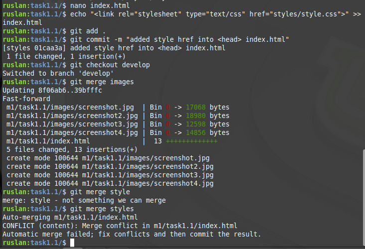

**GIT & GitHub Lesson**
=======================

1. Installing GIT:  
>git version 2.17.1  
	
2,5-9.  
  

10-16.  
  
  

17-19.  
  

We have an **issue**

  

Resolving merge (styles => develop) conflict 

  
  

21.  Merge develop into master  

  

22. Using `git log`  

  

23. Pushing local repo into remote  

  

24,26.  
  

###DevOps

>DevOps is a term that combines three: development, operation and testing. That is a methodology that includes the following practices: continues integration and deployment, automated testing, Infrastructure as Code, configuration management, application monitoring.
