## Task 10  

We have such ansible server configuration ("hosts"-file, group-vars, and ansible.cfg):  

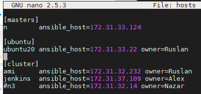  

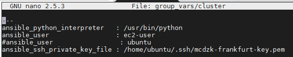  

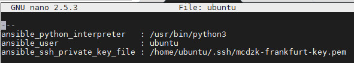  

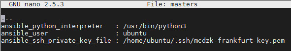  

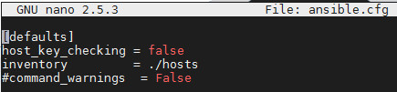  

Let's try simple ad-hoc command:  

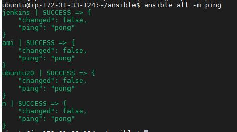  

Almost the same, with the playbook:  

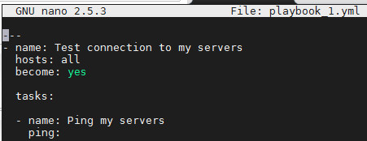  

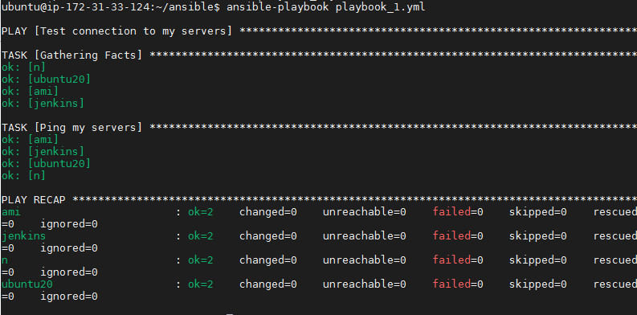  

Install apache server in group servers (Ubuntu):  

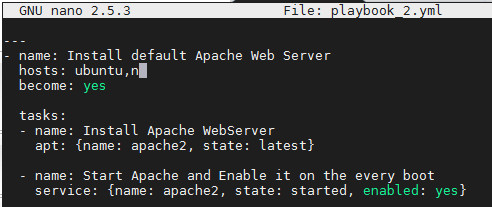  

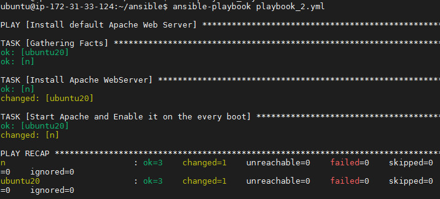  

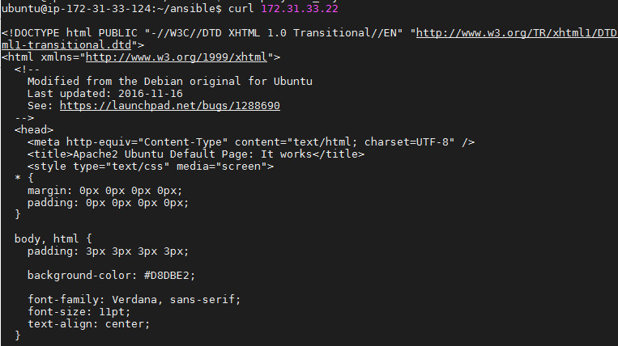  

Install apache server and set HTML page in group servers (RedHat) with handlers:  

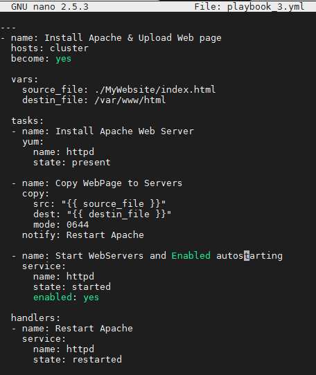  

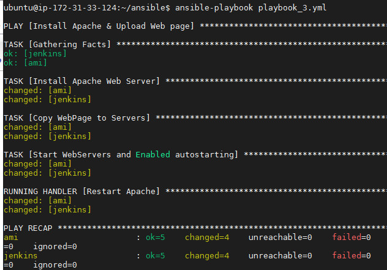  

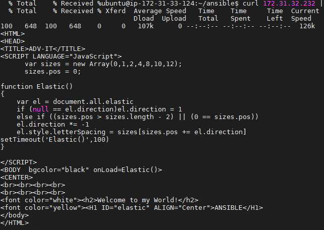  

Install apache server and set HTML page in group servers (RedHat & Ubuntu) with logical selection:  

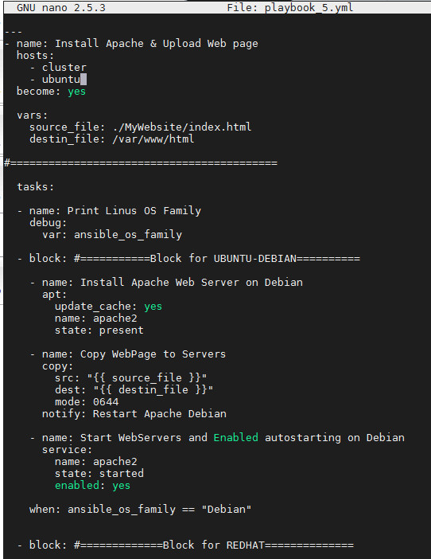
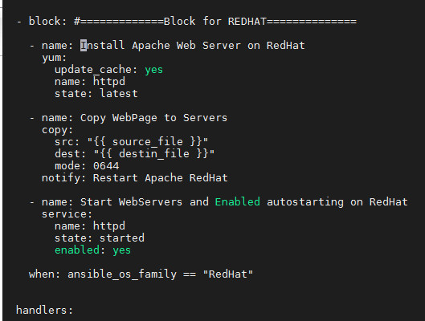
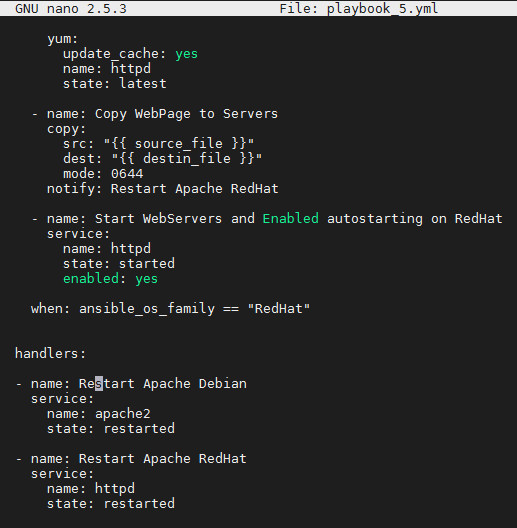  

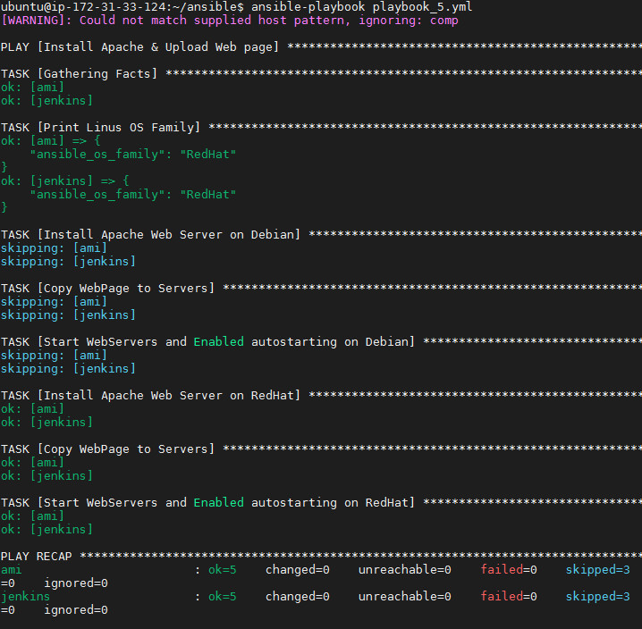  

Using different variables:  

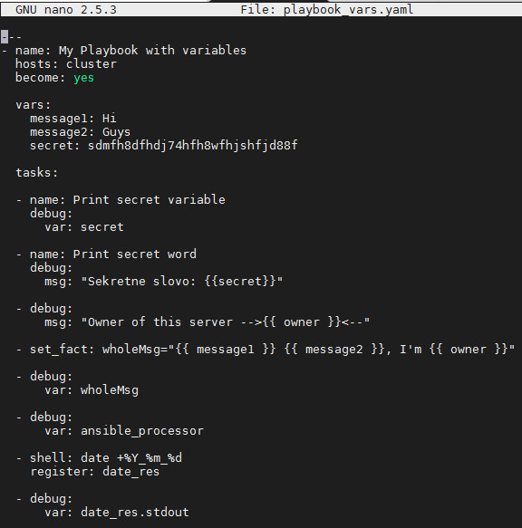  

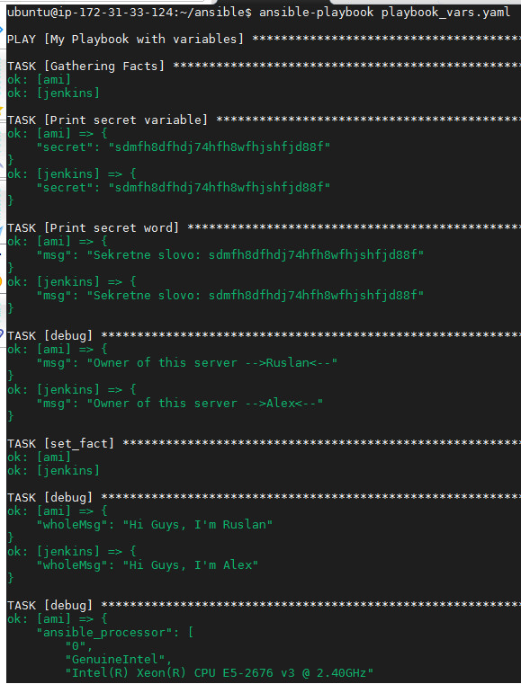  

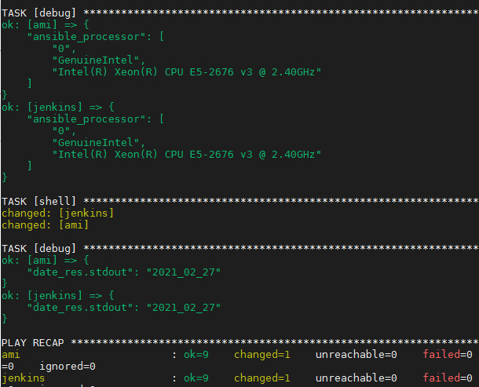  

Loops:  

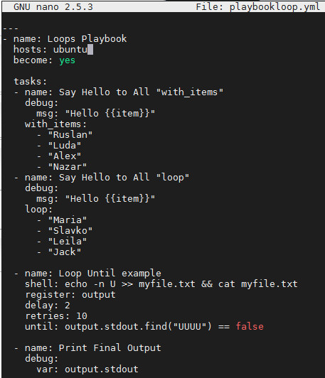  

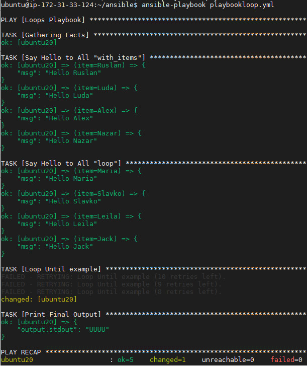  

