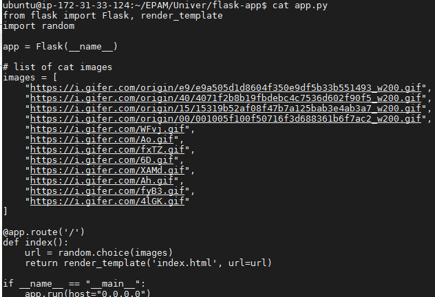
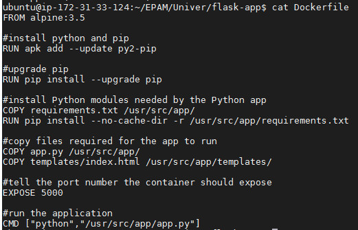
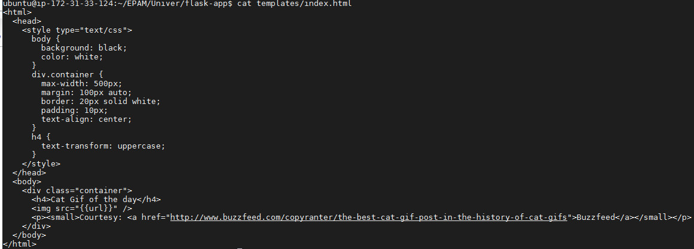
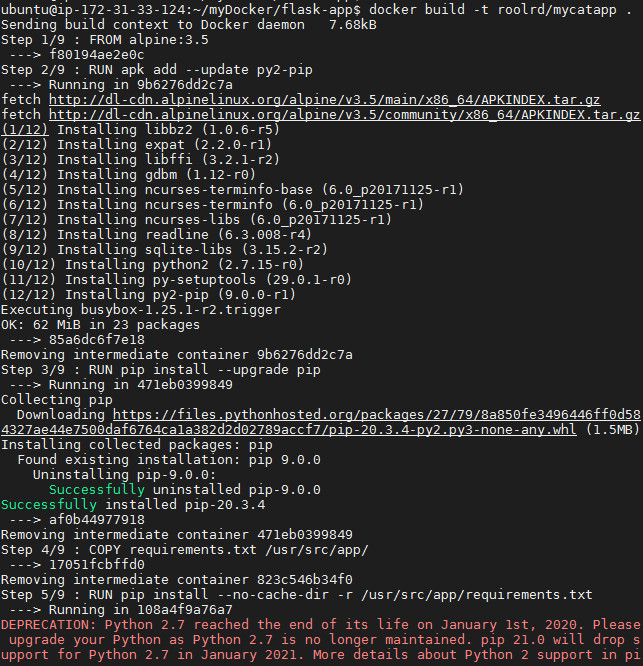
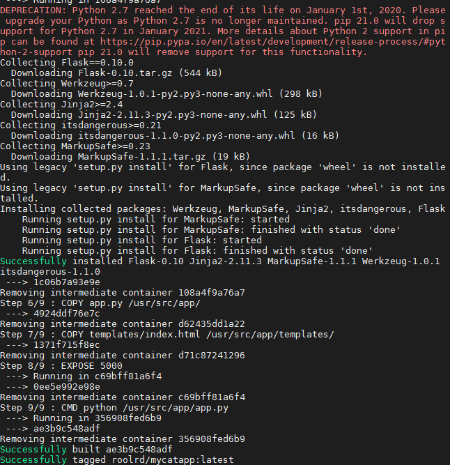
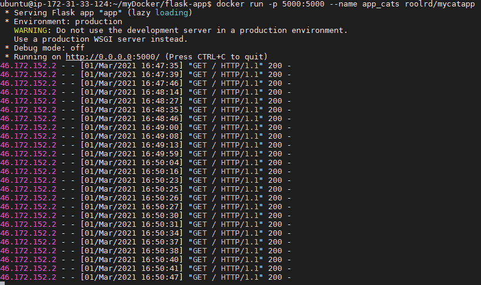
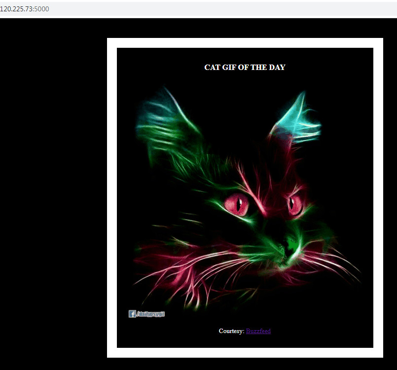
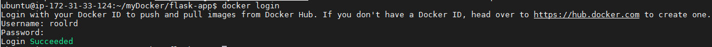
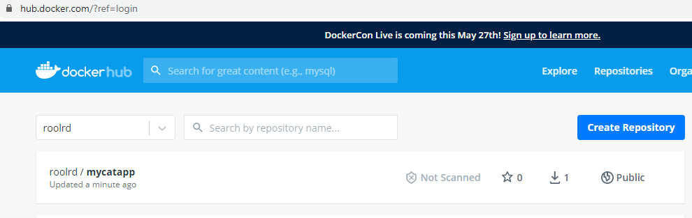
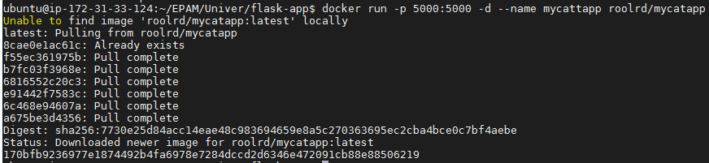

## Task 11. Docker  

#### Create a Python Flask app that displays random cat gifs using Docker 
 
- Python code

  

- Dockerfile

  

- HTML file

  

- build docker image from Docerfile

  

  

- run docker container from created image

  

- enjoy watching the "site"

  

- share my docker image on to dockerHub repository

  - first, login to dockerHub

  

  - push image roolrd/mycatapp on to dockerHub
  
  

  

https://hub.docker.com/repository/docker/roolrd/mycatapp  

- try to run container using docker image from dockerHuber repository

  

