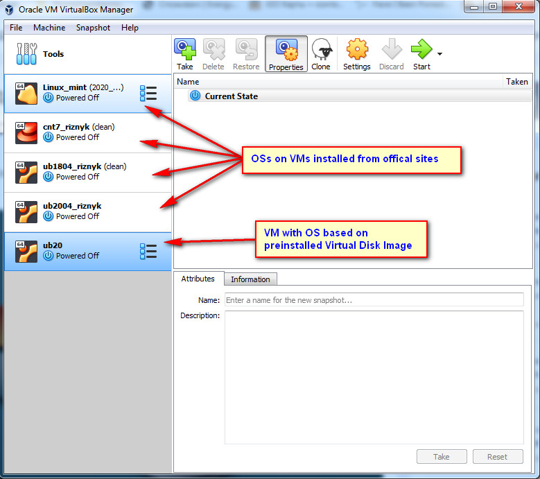
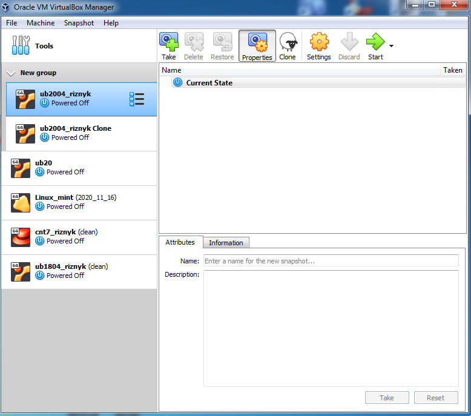
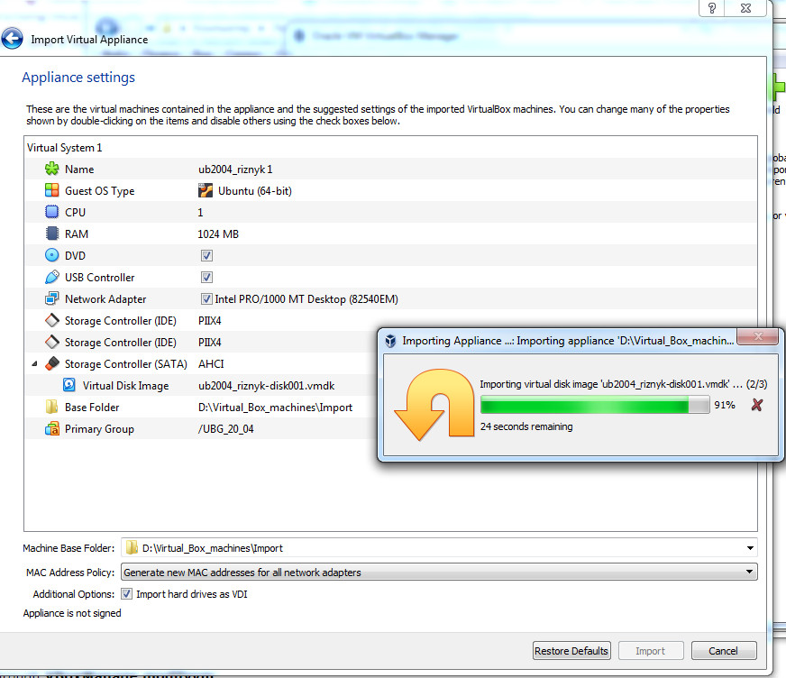
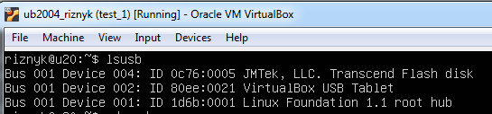
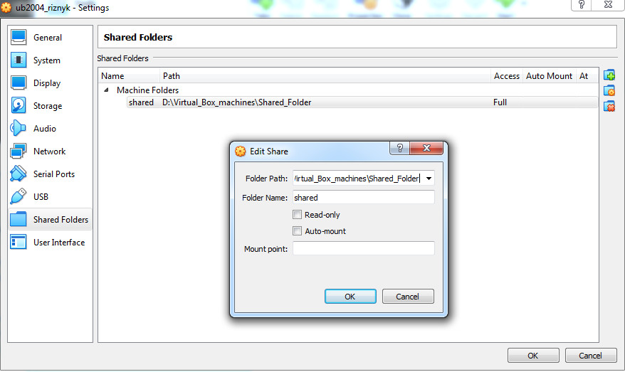

###  HYPERVISORS

1. Most popular hypervisors are - Microsoft Hyper-V, VMware vSphere, 
Oracle VirtualBox, KVM-linux.  

2. Main differences of the most popular hypervisors
    - **Microsoft Hyper-V** is a Windows native hypervisor; it can create virtual
 machines on x86-64 systems running Windows. This product can be free.
    - **VMware vSphere** is a VMware cloud computing platform for virtualization. 
 Free bare-metal hypervisor.
    - **Oracle VirtualBox.** This type 2 hypervisor can run on any OS such as Solaris, 
 Linux, Mac, and Windows. It is compatible with both x86 and x64 OS, and it is quite
 portable. It allows virtual machines to be imported or exported using the Open 
 Virtualization Format (OVF).
    - **KVM-linux.** A kernel-based virtual machine (KVM) is a project-based upon
 HNU/Linux that has been developed for x86 computers. This is a type 1 hypervisor and 
 VMs gain direct access to the hardware
 
### VIRTUAL BOX

1.1 - 1.4 Updating VirtualBox to v.6.1.16(latest) and creating VMs with latest Ubuntu version  

  

1.5 - 1.6 Clone of VM and creating group  
 

~~~~~~~~~~~~~~~~~~~~~

1.8 Export and import VM  

  

  

2.2 Attached USB-drive  

  

2.3 Shared folder  

  

2.4 Network settings  

-------------------------------------------------------------------------    
Mode       | VM->Host | VM<-Host | VM1<->VM2 | VM->Net/Lan | VM<-Net/Lan |  
-------------------------------------------------------------------------  
Host-only  |
-------------------------------------------------------------------------
Internal   | 
-------------------------------------------------------------------------
Bridged    |
-------------------------------------------------------------------------
NAT        |
-------------------------------------------------------------------------
NATservice |
-------------------------------------------------------------------------

