###  HYPERVISORS

1. Most popular hypervisors are - Microsoft Hyper-V, VMware vSphere, 
Oracle VirtualBox, KVM-linux.  

2. Main differences of the most popular hypervisors
    - **Microsoft Hyper-V** is a Windows native hypervisor; it can create virtual
 machines on x86-64 systems running Windows. This product can be free.
    - **VMware vSphere** is a VMware cloud computing platform for virtualization. 
 Free bare-metal hypervisor.
    - **Oracle VirtualBox.** This type 2 hypervisor can run on any OS such as Solaris, 
 Linux, Mac, and Windows. It is compatible with both x86 and x64 OS, and it is quite
 portable. It allows virtual machines to be imported or exported using the Open 
 Virtualization Format (OVF).
    - **KVM-linux.** A kernel-based virtual machine (KVM) is a project-based upon
 HNU/Linux that has been developed for x86 computers. This is a type 1 hypervisor and 
 VMs gain direct access to the hardware
 
### VIRTUAL BOX

1.1 - 1.4 Updating VirtualBox to v.6.1.16(latest) and creating VMs with latest Ubuntu version  

  

1.5 - 1.6 Clone of VM and creating group  
 


1.7 Snapshots  

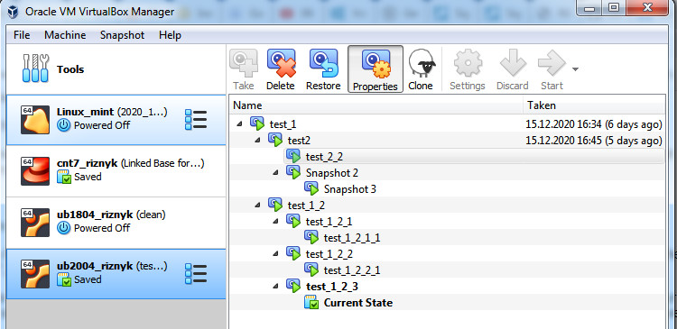  

1.8 Export and import VM  

  

  

2.2 Attached USB-drive  

  

2.3 Shared folder  

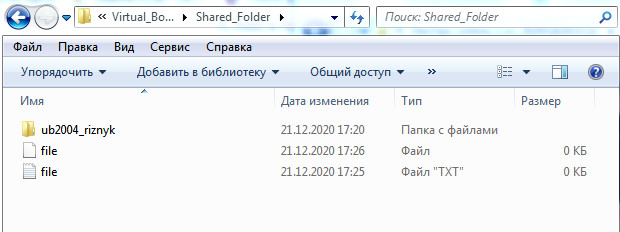  

  

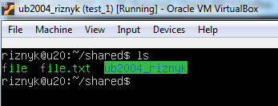  

2.4 Network settings  

|     Mode    | VM->Host | VM<-Host | VM1<->VM2 | VM->Net/Lan | VM<-Net/Lan |
|:-----------|:--------|:--------|:---------|:-----------|:-----------|
| Host-only   |    -      |    +      |    -       |      -       |     -       |
| Internal    |     -     |    -      |      -/+     |       -      |      -       |
| Bridged     |    +      |    +      |    +       |     +        |     +        |
| NAT         |     +     |     forward     |      -     |      +       |            |
| NAT-service |    -      |     -    |     -      |     -        |      -       |


3. CLI VBoxManage commands  

3.2.1 VBoxManage list, showvminfo  

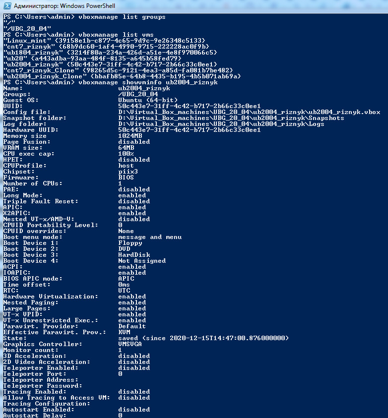

3.2.2 VBoxManage createvm  

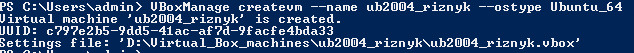  

[3.2.2_2 ub2004_riznyk.vbox](./ub2004_riznyk/ub2004_riznyk.vbox)  

3.2.3 VBoxManage startvm  

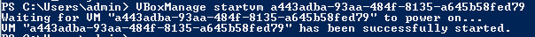  

3.2.4 VBoxManage controlvm  

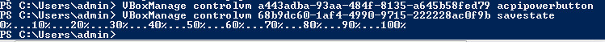  

3.2.5 VBoxManage modifyvm  

  

3.2.6 VBoxManage clonevm  

  

3.2.7 VBoxManage snapshot  

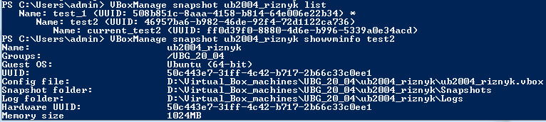  


### VAGRANT  

1-4.  

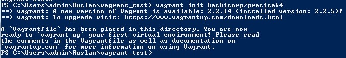  

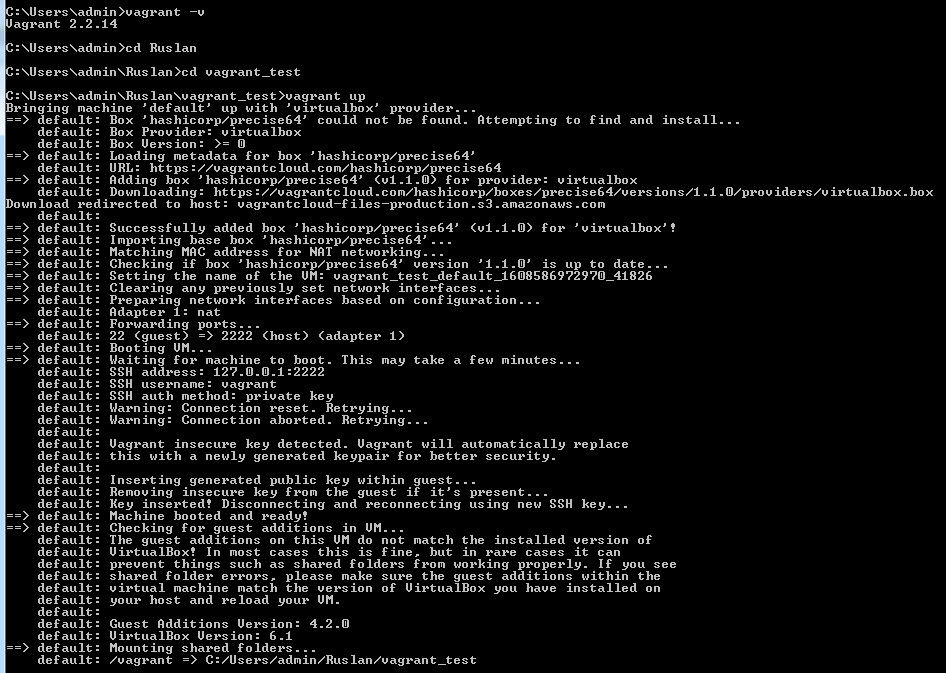  

5. Connect to the Vagrant VM  

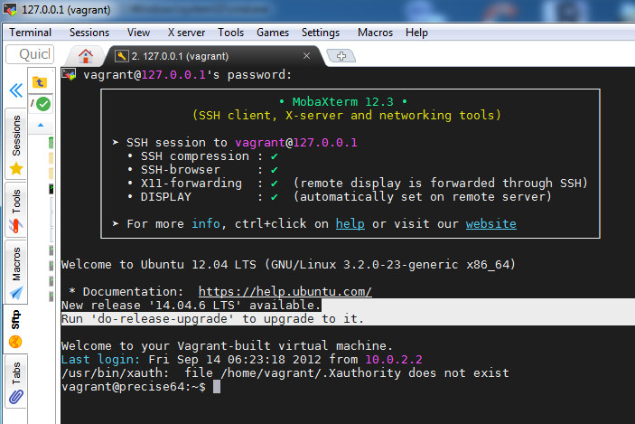  

6. 

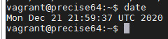  

7. Stop and delete  

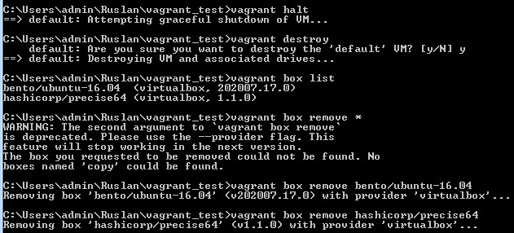  

8. My own Vagrant Box  

Create a new Virtual Machine with the following settings:  
Name: VagrantBox_CentOS7  
Type: Linux  
Version: Red Hat (64-bit)  
Memory Size: 512MB  
New Virtual Disk: [Size: 40 GB]  
Disable audio  
Disable USB  
Disable Floppy  
Network Adapter 1 is set to NAT  
Add port-forwarding rule: [Name: SSH, Protocol: TCP, Host IP: blank, Host Port: 2222, Guest IP: blank, Guest Port: 22]  

Install CentOS7  
default user - vagrant  
password - vagrant  

Set Root Password  
```
sudo passwd root  
<vagrant>  
su - 
```

Setup the Super User  
```
visudo -f /etc/sudoers.d/vagrant
# add vagrant user
vagrant ALL=(ALL) NOPASSWD:ALL
exit
sudo pwd
```

Updating and installing 
```
sudo yum update -y
sudo yum upgrade -y
sudo yum install nano wget bzip2
sudo shutdown -r now
```

Configure SSH  
```
mkdir -p /home/vagrant/.ssh
chmod 0700 /home/vagrant/.ssh
wget --no-check-certificate \
    https://raw.github.com/mitchellh/vagrant/master/keys/vagrant.pub \
    -O /home/vagrant/.ssh/authorized_keys
chmod 0600 /home/vagrant/.ssh/authorized_keys
chown -R vagrant /home/vagrant/.ssh
sudo nano /etc/ssh/sshd_config
>string will look like "AuthorizedKeysFile %h/.ssh/authorized_keys
sudo service sshd restart
```

Install Kernel Headers in CentOS 7  
```
cd /usr/src/kernels/  
yum install kernel-devel  
ls -l /usr/src/kernels/$(uname -r)  
uname -r  
```

Install Guest tool  
```
sudo mount /dev/cdrom /mnt 
cd /mnt
sudo ./VBoxLinuxAdditions.run
```

Compress Box  
```
sudo dd if=/dev/zero of=/EMPTY bs=1M
sudo rm -f /EMPTY
```

Create work folder for Vagrant Box  
```
mkdir ~\Ruslan\vagrant_test\vagrant_boxes
cd ~\Ruslan\vagrant_test\vagrant_boxes
```

Create and Test package  
```
vagrant package --base VagrantBox_CentOS7
vagrant box add VagrantBox_CentOS7 package.box
vagrant init VagrantBox_CentOS7
vagrant up
vagrant ssh
```

Distributing the Box to HashiCorp's Vagrant Cloud  

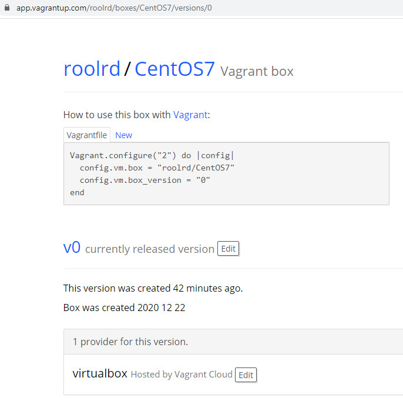