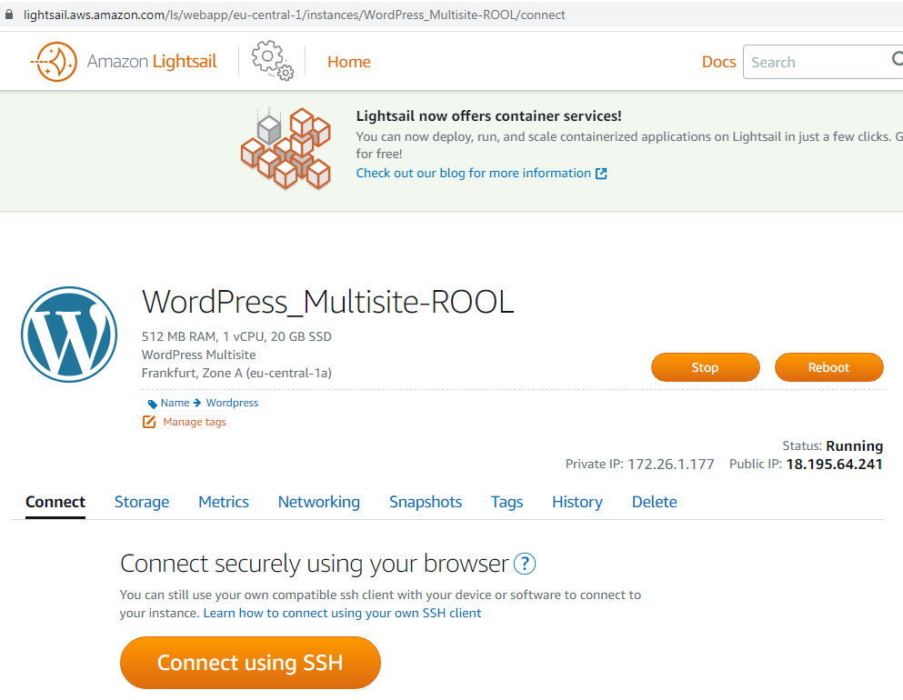
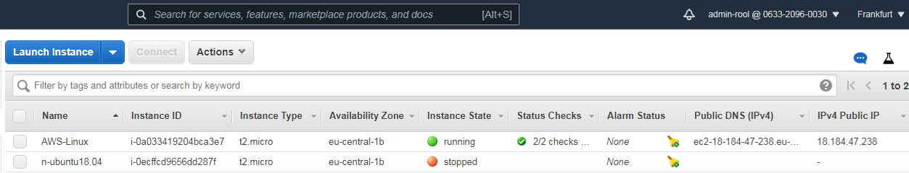
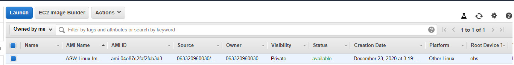
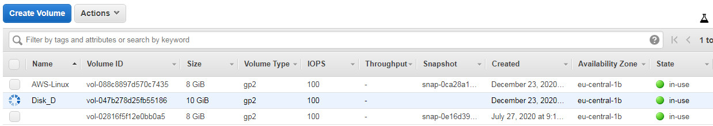
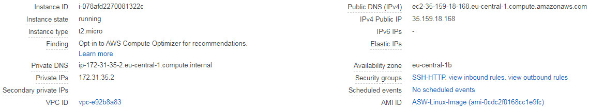
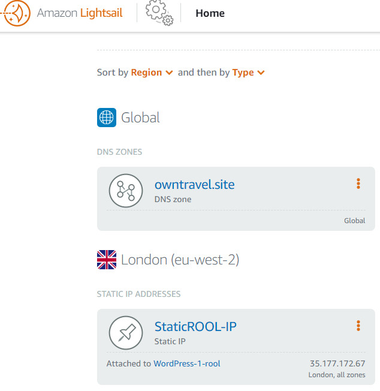
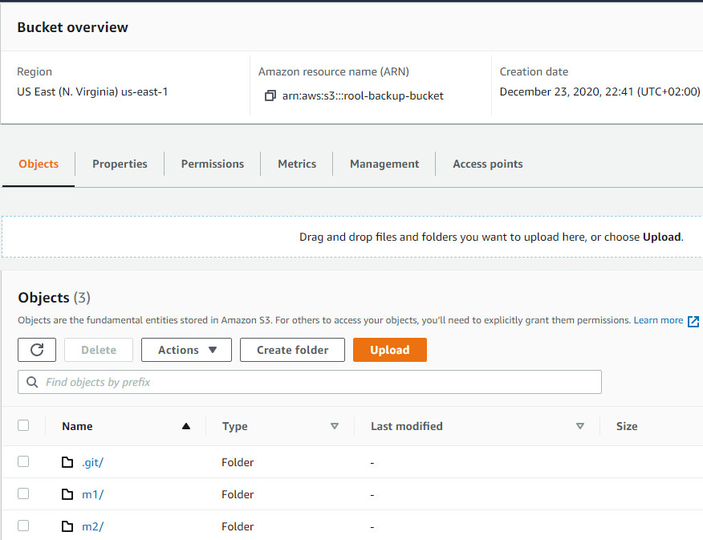

###   Virtualization and Cloud Basic  

4. Lightsale  

  

5. EC2-instanse (AWS-Linux)  

  

6. AWS-Linux snapshot


 
7. Creating volume Disk_D  

  

Attach Volume to AWS-Linux instance

```
sudo fdisk -l
sudo fdisk /dev/xvdf -> n -> p -> w
sudo mkfs.ext4 /dev/xvdf1
sudo mkdir /mnt/disk_d
sudo mount /dev/xvdf1 /mnt/disk_d
blkid
sudo nano /etc/fstab 
<  UUID=c31a23d3-fdcc-453f-8a77-568e71494040     /mnt/disk_d auto   rw,user,auto,noexec 0 2 >
cd disk_d
sudo chown -R ec2-user:ec2-user /mnt/disk_d
echo "Hello disk_d" > Hello.txt
```

8. Launch istance form backup  

  

9. Detach and attach disk_d  

```
sudo mkdir /mnt/disk_d
sudo chown -R ec2-user:ec2-user /mnt/disk_d
sudo mount /dev/xvdf1 /mnt/disk_d
echo "Hello disk_d from AWS-Linux-3" >> Hello.txt
sudo nano /etc/fstab 
<  UUID=c31a23d3-fdcc-453f-8a77-568e71494040     /mnt/disk_d auto   rw,user,auto,noexec 0 2 >
```

10. Lightsale site 
```
cat $HOME/bitnami_application_password
password - 
user - user
```

  

11. S3-buckets  

  

15. Static website  

http://roolrd.owntravel.site.s3-website.eu-central-1.amazonaws.com


