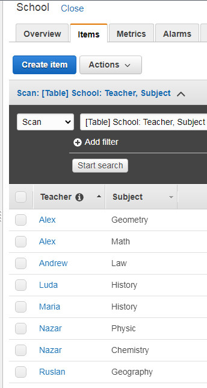

### PART 1  

3. Database named COMPANY containes tables: EMPLOYEE, SALARY_GRADE, DEPARTMENT.  

4.   

```
CREATE DATABASE COMPANY;
SHOW DATABASES;
+--------------------+
| Database           |
+--------------------+
| COMPANY            |
| information_schema |
| mysql              |
| performance_schema |
| sys                |
+--------------------+
USE COMPANY;
CREATE TABLE DEPARTMENT (ID INT NOT NULL, NAME VARCHAR(30), CITY VARCHAR(30));
CREATE TABLE EMPLOYEE (ID INT PRIMARY KEY, FIRSTNAME VARCHAR(30), LASTNAME VARCHAR(30), POSITION VARCHAR(10), DATE_EMPLOYMENT DATE, ID_DEPARTMENT INT, ID_BOSS INT, RATE INT, BONUS INT);
ALTER TABLE DEPARTMENT ADD CONSTRAINT ID PRIMARY KEY (ID);
ALTER TABLE EMPLOYEE ADD FOREIGN KEY(ID_DEPARTMENT) REFERENCES DEPARTMENT(ID) ON DELETE CASCADE;
CREATE TABLE SALARY_GRADE (ID INT PRIMARY KEY, LOW_SALARY INT, HIGH_SALARY INT);

CREATE USER 'toor'@'localhost' IDENTIFIED BY 'password';
```

5.  

```
INSERT INTO EMPLOYEE (ID, FIRSTNAME, LASTNAME, POSITION, DATE_EMPLOYMENT, ID_DEPARTMENT, ID_BOSS, RATE, BONUS) VALUES (1, 'Яськів', 'Антон', 'Boss', '10/11/1998', 1, NULL, 8600, NULL);
INSERT INTO EMPLOYEE (ID, FIRSTNAME, LASTNAME, POSITION, DATE_EMPLOYMENT, ID_DEPARTMENT, ID_BOSS, RATE, BONUS) VALUES (2, 'Мельник', 'Ольга', 'Manager', '2011-09-03', 1, 1, 5400, NULL);
INSERT INTO EMPLOYEE (ID, FIRSTNAME, LASTNAME, POSITION, DATE_EMPLOYMENT, ID_DEPARTMENT, ID_BOSS, RATE, BONUS) VALUES (3, 'Коваленко', 'Тарас', 'Manager', '2008-04-15', 2, 1, 4800, NULL);
INSERT INTO EMPLOYEE (ID, FIRSTNAME, LASTNAME, POSITION, DATE_EMPLOYMENT, ID_DEPARTMENT, ID_BOSS, RATE, BONUS) VALUES (6, 'Руденко', 'Ігор', 'Seller', '2006-04-11', 1, 2, 3500, 360);
INSERT INTO EMPLOYEE (ID, FIRSTNAME, LASTNAME, POSITION, DATE_EMPLOYMENT, ID_DEPARTMENT, ID_BOSS, RATE, BONUS) VALUES (7, 'Павленко', 'Леся', 'Seller', '2004-04-14', 3, 2, 3200, 390);
INSERT INTO EMPLOYEE (ID, FIRSTNAME, LASTNAME, POSITION, DATE_EMPLOYMENT, ID_DEPARTMENT, ID_BOSS, RATE, BONUS) VALUES (18, 'Ярмолюк', 'Олександра', 'Consultant', '2003-12-02', 2, 3, 3200, NULL);
INSERT INTO EMPLOYEE (ID, FIRSTNAME, LASTNAME, POSITION, DATE_EMPLOYMENT, ID_DEPARTMENT, ID_BOSS, RATE, BONUS) VALUES (19, 'Шевченко', 'Антон', 'Consultant', '2003-01-09', 1, 2, 2500, NULL);
INSERT INTO EMPLOYEE (ID, FIRSTNAME, LASTNAME, POSITION, DATE_EMPLOYMENT, ID_DEPARTMENT, ID_BOSS, RATE, BONUS) VALUES (20, 'Гончаренко', 'Василь', 'Consultant', '1999-08-16', 3, 4, 2500, NULL);
```

6.  

```
SELECT FIRSTNAME, LASTNAME, RATE FROM EMPLOYEE WHERE RATE >= 3000 AND RATE <= 5000;
SELECT FIRSTNAME, LASTNAME, POSITION FROM EMPLOYEE WHERE POSITION = 'MANAGER' OR POSITION = 'SELLER';
SELECT NAME, CITY FROM DEPARTMENT ORDER BY CITY DESC, NAME ASC;
SELECT EMPLOYEE.ID, FIRSTNAME, LASTNAME, NAME AS DEPARTMENT_NAME FROM EMPLOYEE JOIN DEPARTMENT ON EMPLOYEE.ID_DEPARTMENT = DEPARTMENT.ID;
SELECT ID_DEPARTMENT, COUNT(*) FROM EMPLOYEE GROUP BY ID_DEPARTMENT;
SELECT NAME, COUNT(EMPLOYEE.ID) COUNT_EMPLOYEE FROM DEPARTMENT LEFT JOIN EMPLOYEE ON DEPARTMENT.ID = ID_DEPARTMENT GROUP BY NAME;
```

7.  
DDL  

```
ALTER TABLE DEPARTMENT ADD STREET VARCHAR (40);
ALTER TABLE DEPARTMENT DROP COLUMN STREET;
```
DML  

```
INSERT INTO EMPLOYEE (ID, FIRSTNAME, LASTNAME, POSITION, DATE_EMPLOYMENT, ID_DEPARTMENT, ID_BOSS, RATE, BONUS) VALUES (17, 'Семенюк', 'Андрій', 'Seller', '2014-10-07', 4, 2, 3200, 400);
SELECT * FROM EMPLOYEE;
UPDATE EMPLOYEE SET RATE = RATE * 1.5 WHERE ID = 19; 
DELETE FROM EMPLOYEE WHERE ID_DEPARTMENT = 4; 
```

DCL  

```
GRANT SELECT ON COMPANY.* TO 'toor'@'localhost';
SHOW GRANTS FOR 'toor'@'localhost';
REVOKE ALL ON *.* FROM 'toor'@'localhost';
```

8.  

```
CREATE USER 'alex'@'localhost' IDENTIFIED BY 'alex';
CREATE USER 'nazar'@'localhost' IDENTIFIED BY 'nazar';
CREATE USER 'mark'@'localhost' IDENTIFIED BY 'mark';
GRANT CREATE,DROP,INSERT,ALTER ON *.* TO 'toor'@'localhost';
GRANT SELECT ON *.* TO 'alex'@'localhost';
GRANT GRANT OPTION ON *.* TO 'nazar'@'localhost';
GRANT INSERT,DROP,ALTER,DELETE,SELECT ON COMPANY.* TO 'mark'@'localhost';
SHOW GRANTS FOR 'alex'@'localhost';
SHOW GRANTS FOR 'nazar'@'localhost';
SHOW GRANTS FOR 'mark'@'localhost';
SHOW GRANTS FOR 'toor'@'localhost';
```
9.  

  

  


### PART 2  

10. BACKUP   
sudo mysqldump -uroot -p$pass COMPANY > COMPANY_DB.sql  

11. 

```
SHOW TABLES;
DROP TABLE SALARY_GRADE;
```

12. RESTORING
```
sudo mysql -u root -p COMPANY < COMPANY_DB.sql
```

13. Transfer to RDS  

```
scp -i mcdzk-frankfurt-key.pem COMPANY_DB.sql ubuntu@<PublicIP-AWS-EC2 on the same AZ as RDS-instanse>

on EC2:
telnet company-rds.cpjkpr5piyap.eu-central-1.rds.amazonaws.com 3306

mysql -u rool -p<password> -hcompany-rds.cpjkpr5piyap.eu-central-1.rds.amazonaws.com
show databases;
exit

mysql -u rool -p<password> -hcompany-rds.cpjkpr5piyap.eu-central-1.rds.amazonaws.com test_db < COMPANY_DB.sql
mysql -u rool -p<password> -hcompany-rds.cpjkpr5piyap.eu-central-1.rds.amazonaws.com
use test_db
```

14.  Queries to RDS DB  

  

```
INSERT INTO EMPLOYEE (ID, FIRSTNAME, LASTNAME, POSITION, DATE_EMPLOYMENT, ID_DEPARTMENT, ID_BOSS, RATE, BONUS) VALUES (17, 'Семенюк', 'Андрій', 'Seller', '2014-10-07', 4, 2, 3200, 400);
```

15.  

  

16.  Dump of RDS DB  

```
exit
mysql -u root -p
CREATE DATABASE COMPANY_REP2;
SET GLOBAL server_id = 21;
CREATE USER 'alex'@'localhost' IDENTIFIED BY 'alex';
GRANT ALL PRIVILEGES ON COMPANY_REP2.* TO 'alex'@'localhost';
exit
mysqldump -hcompany-rds.cpjkpr5piyap.eu-central-1.rds.amazonaws.com -u rool -pKzAA46ccdh93FuYT --port=3306 --single-transaction --routines --triggers   --databases test_db > ./rds-dump.sql
mysql -u root -p COMPANY_REP2 < rds-dump.sql
mysql -u root -p
use test_db;
show tables;
SELECT * FROM EMPLOYEE;
```

### PART 3  

17. Create AMAZON DYNAMO DB  

  

18. Insert data  

  

19. Queries  

  


