1.  

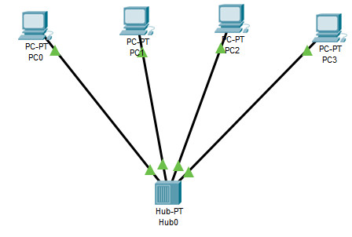  

5.  

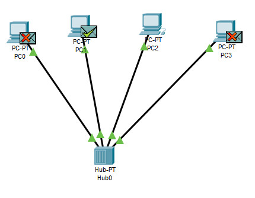  

6.  

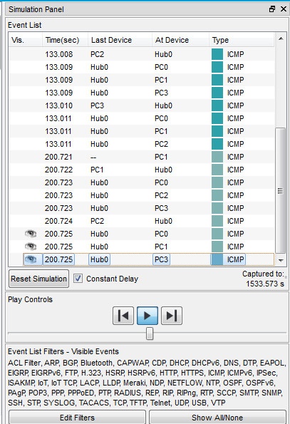  

7.  

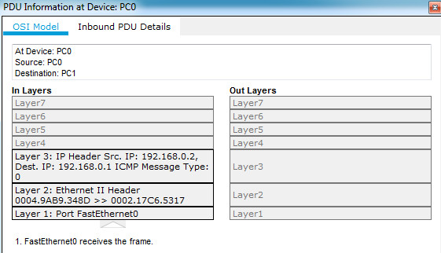  

8.  

  

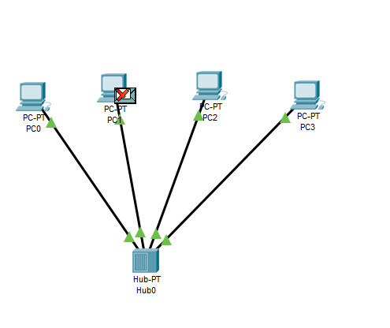  

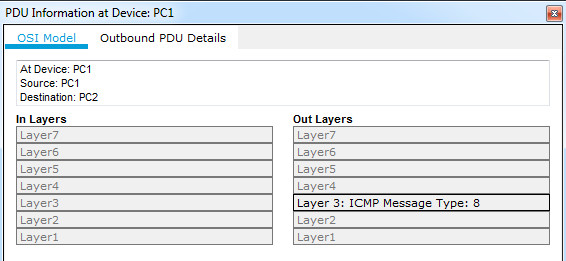  

9.  

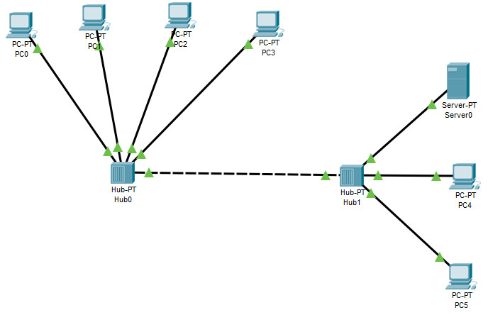  

  

  

  

12.  У випадку з'єднання комп'ютерів між собою через комутатор, пакети призначені для одного комп'ютера надсилаються лише до нього. На відміну від з'єднання через hub-концентратор, де пакет "копіюється" і надсилається усім в мережі, і вже самі комп'ютери відкидають адресований не їм пакет.  

  

  

  

 

14.  

  

  

  

18. 

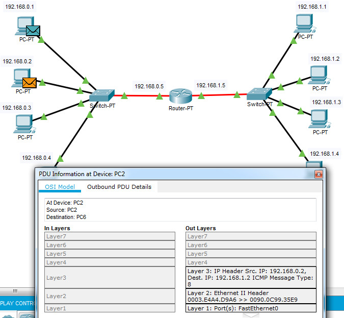  

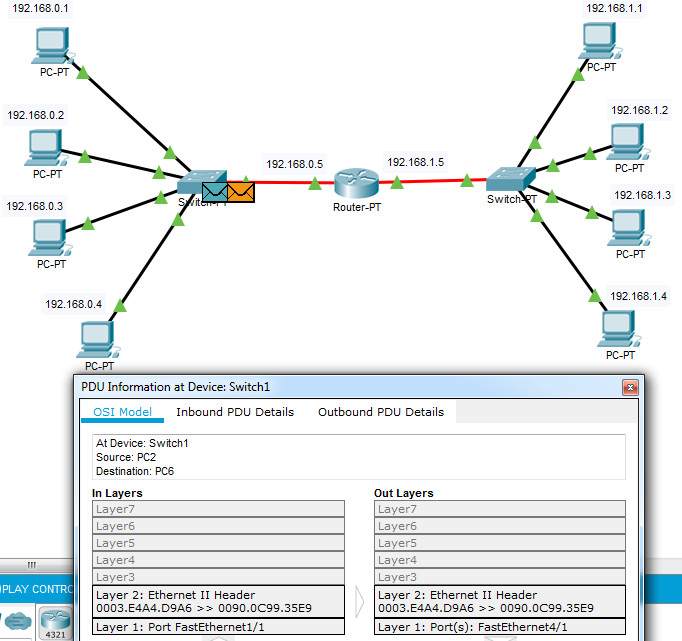  

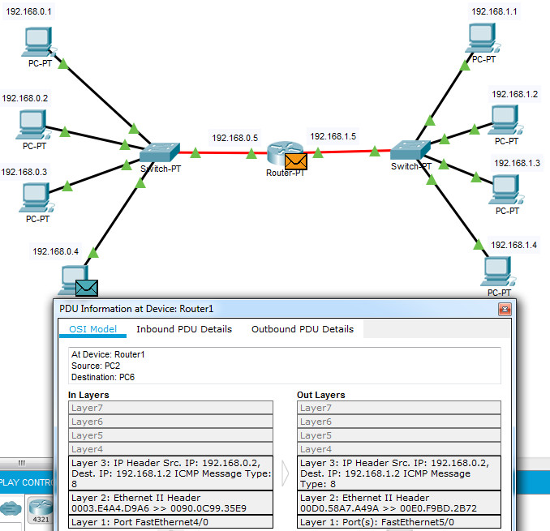  

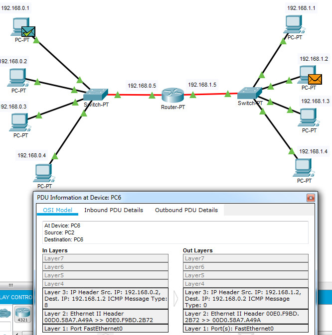 

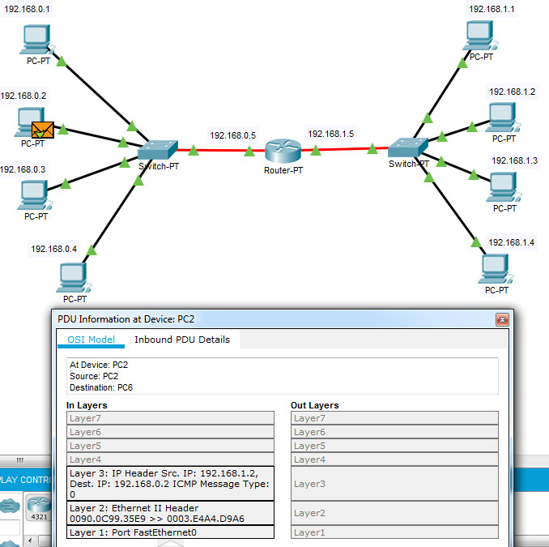 

