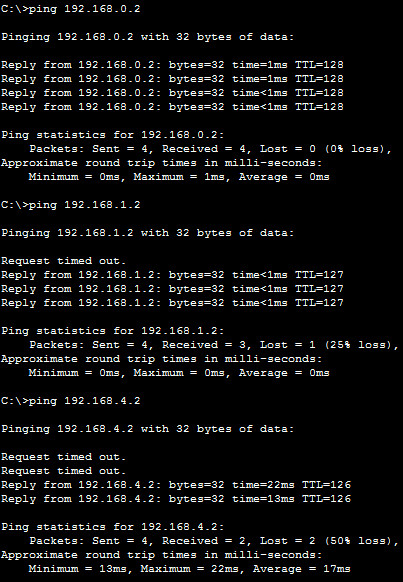
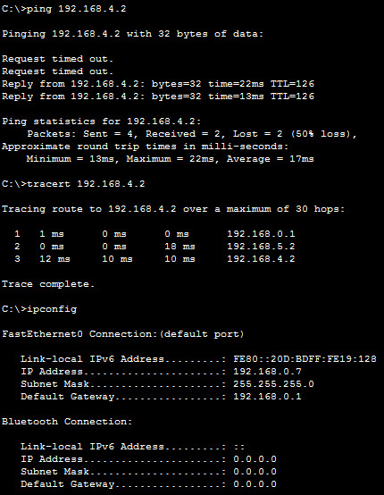

### 1.  
Creating a network model on CiscoPacketTracer, which is located in two buildings with two floors. The network IP address is 192.168.0.0/24.  

  

I have done a network analysis using Traffic Generator and ping-command.  

  

  

  

### 2.  
Network model on CiscoPacketTracer, which is located in four-storey building. The network consists of 8 (5 + 3) subnets on the each floor. Subnens have the following IP-addresses 192.168.1.0/24, 192.168.2.0/24...192.168.8.0/24. Switches is connected via gigabit ports.  Hosts on subnets without a router do not have a logical interconnection with hosts on other corporate subnets.

  

  

### 3.  
The network model consists of 5 subnets (192.168.0.0/24, 192.168.1.0/24...192.168.4.0/24). Each subnet is located in a separate bulding and connected via two routers.  

  

#### Configure static routing  

##### On the Router1 (2901)
```
Router>en
Router#conf t
Router(config)#ip route 192.168.2.0 255.255.255.0 192.168.5.2
Router(config)#ip route 192.168.3.0 255.255.255.0 192.168.5.2
Router(config)#ip route 192.168.4.0 255.255.255.0 192.168.5.2
Router(config)#end
Router#wr
Building configuration...
[OK]
###################################################################
Router#sh ip route
Codes: L - local, C - connected, S - static, R - RIP, M - mobile, B - BGP
       D - EIGRP, EX - EIGRP external, O - OSPF, IA - OSPF inter area
       N1 - OSPF NSSA external type 1, N2 - OSPF NSSA external type 2
       E1 - OSPF external type 1, E2 - OSPF external type 2, E - EGP
       i - IS-IS, L1 - IS-IS level-1, L2 - IS-IS level-2, ia - IS-IS inter area
       * - candidate default, U - per-user static route, o - ODR
       P - periodic downloaded static route

Gateway of last resort is 192.168.5.2 to network 0.0.0.0

     192.168.0.0/24 is variably subnetted, 2 subnets, 2 masks
C       192.168.0.0/24 is directly connected, GigabitEthernet0/0
L       192.168.0.1/32 is directly connected, GigabitEthernet0/0
     192.168.1.0/24 is variably subnetted, 2 subnets, 2 masks
C       192.168.1.0/24 is directly connected, GigabitEthernet0/1
L       192.168.1.1/32 is directly connected, GigabitEthernet0/1
S    192.168.2.0/24 [1/0] via 192.168.5.2
S    192.168.3.0/24 [1/0] via 192.168.5.2
S    192.168.4.0/24 [1/0] via 192.168.5.2
     192.168.5.0/24 is variably subnetted, 2 subnets, 2 masks
C       192.168.5.0/30 is directly connected, GigabitEthernet0/3/0
L       192.168.5.1/32 is directly connected, GigabitEthernet0/3/0
S*   0.0.0.0/0 [1/0] via 192.168.5.2
```

#### On the Router2 (2911)
```
Router>en
Router#conf t
Router(config)#ip route 192.168.0.0 255.255.255.0 192.168.5.1
Router(config)#ip route 192.168.1.0 255.255.255.0 192.168.5.1
Router(config)#end
Router#wr
Building configuration...
[OK]
#########################################################################
Router#sh ip route
Codes: L - local, C - connected, S - static, R - RIP, M - mobile, B - BGP
       D - EIGRP, EX - EIGRP external, O - OSPF, IA - OSPF inter area
       N1 - OSPF NSSA external type 1, N2 - OSPF NSSA external type 2
       E1 - OSPF external type 1, E2 - OSPF external type 2, E - EGP
       i - IS-IS, L1 - IS-IS level-1, L2 - IS-IS level-2, ia - IS-IS inter area
       * - candidate default, U - per-user static route, o - ODR
       P - periodic downloaded static route

Gateway of last resort is 192.168.5.1 to network 0.0.0.0

S    192.168.0.0/24 [1/0] via 192.168.5.1
S    192.168.1.0/24 [1/0] via 192.168.5.1
     192.168.2.0/24 is variably subnetted, 2 subnets, 2 masks
C       192.168.2.0/24 is directly connected, GigabitEthernet0/0
L       192.168.2.1/32 is directly connected, GigabitEthernet0/0
     192.168.3.0/24 is variably subnetted, 2 subnets, 2 masks
C       192.168.3.0/24 is directly connected, GigabitEthernet0/2
L       192.168.3.1/32 is directly connected, GigabitEthernet0/2
     192.168.4.0/24 is variably subnetted, 2 subnets, 2 masks
C       192.168.4.0/24 is directly connected, GigabitEthernet0/1
L       192.168.4.1/32 is directly connected, GigabitEthernet0/1
     192.168.5.0/24 is variably subnetted, 2 subnets, 2 masks
C       192.168.5.0/30 is directly connected, GigabitEthernet0/1/0
L       192.168.5.2/32 is directly connected, GigabitEthernet0/1/0
S*   0.0.0.0/0 [1/0] via 192.168.5.1
```

#### Checking connection 
```
ping 192.168.4.5
tracert 192.168.4.5

Tracing route to 192.168.4.5 over a maximum of 30 hops: 

  1   1 ms      0 ms      0 ms      192.168.0.1
  2   0 ms      0 ms      0 ms      192.168.5.2
  3   0 ms      1 ms      0 ms      192.168.4.5

Trace complete.
```
  

  
