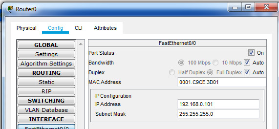
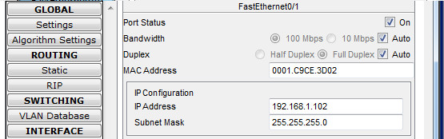
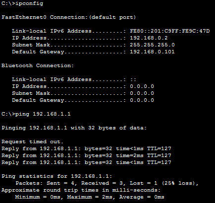

### Create a network  


### Router configuration  

 

  

### Set a password  

```
Router>en
Router#conf t
Router(config)#enable secret 123456
Router(config)#exit
Router#copy running-config startup-config 
Destination filename [startup-config]? 
Building configuration...
[OK]
```

### RIP Config  

  

### Check availability  



