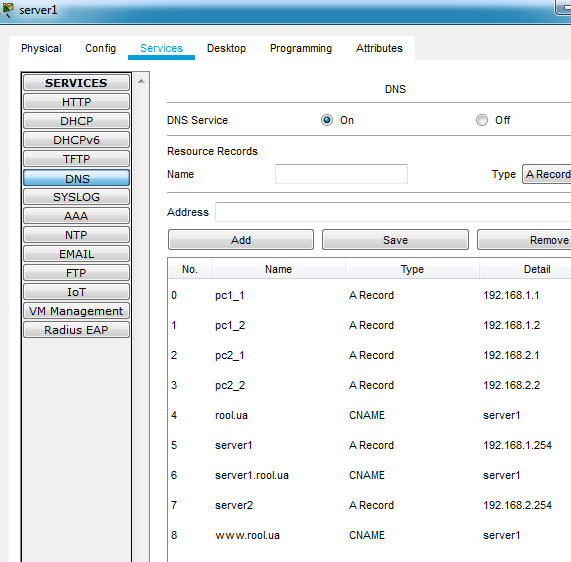

1. The task have done on task 4.2.3  

2. Creating a network with two subnets - 192.168.1.0/24, 192.168.2.0/24. Subnets are interconnected using Router0. Router ports has such IP-addresses fa9/0 - 192.168.1.100, fa8/0 - 192.168.2.100.  

  

On the "server1, server2 ->  services -> DNS" added A- and CNAME-records  

  

  

On the computers and servers added Default Gateway and DNS Server IP-addresses. Let's check results.  

  

  

