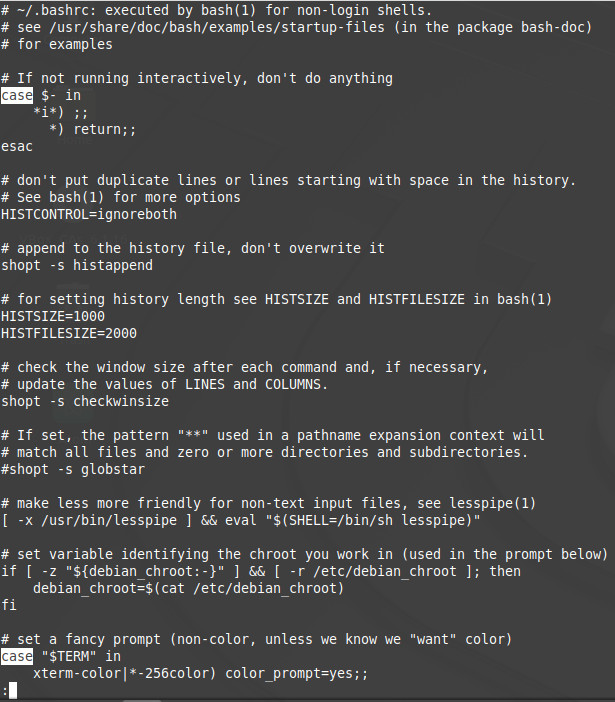

### Task1.Part1  

###### 1. Log in to the system as root  
```
ruslan:~/$ sudo -i
enter password: *******
```

###### 2. Use the passwd command to change the password  
```
root@mint:~# passwd
Enter new UNIX password: 
Retype new UNIX password: 
passwd: password updated successfully

root@mint:~# cat /etc/shadow | head -1
root:$6$KLAnwdBx$r2ZF4GD7ovCVDtk/cM2xq1efhTSRbkSXAGczcDd4vuIgAV8MrPhLgNqEnHIO5.5gtkfSXyuW6219lIuT08VoB0:18644:0:99999:7:::
```
The "passwd"-command changes /etc/shadow file.  

###### 3. Determine the users registered in the system, as well as what commands they execute.  
```
root@mint:~# w 
22:10:06 up 21 min,  3 users,  load average: 0,52, 0,65, 0,77
USER     TTY      FROM             LOGIN@   IDLE   JCPU   PCPU WHAT
ruslan   tty1     -                21:50   19:45   0.34s  0.26s -bash
ruslan   tty7     :0               21:50   21:18  24.99s  1.06s cinnamon-session --
olexandr tty2     -                22:07    1:17   0.84s  0.67s top
```
We can get information about active sessions of all users, which virtual consoles they are using, the time when they logged in, load average

###### 5.  
```
root@mint:~# info sudo

sudo, sudoedit — execute a command as another user  
-i, --login
                 Run the shell specified by the target user's password data‐
                 base entry as a login shell.  This means that login-specific
                 resource files such as .profile or .login will be read by
                 the shell.  If a command is specified, it is passed to the
                 shell for execution via the shell's -c option.  If no com‐
                 mand is specified, an interactive shell is executed.  sudo
                 attempts to change to that user's home directory before run‐
                 ning the shell.  The command is run with an environment sim‐
                 ilar to the one a user would receive at log in.  The Command
                 environment section in the sudoers(5) manual documents how
                 the -i option affects the environment in which a command is
                 run when the sudoers policy is in use.  
-s, --shell
                 Run the shell specified by the SHELL environment variable if
                 it is set or the shell specified by the invoking user's
                 password database entry.  If a command is specified, it is
                 passed to the shell for execution via the shell's -c option.
                 If no command is specified, an interactive shell is exe‐
                 cuted.  

root@mint:~# man passwd

passwd - change user password  
-d, --delete
           Delete a user's password (make it empty). This is a quick way to
           disable a password for an account. It will set the named account
           passwordless.  
-S, --status
           Display account status information. The status information
           consists of 7 fields. The first field is the user's login name.
           The second field indicates if the user account has a locked
           password (L), has no password (NP), or has a usable password (P).
           The third field gives the date of the last password change. The
           next four fields are the minimum age, maximum age, warning period,
           and inactivity period for the password. These ages are expressed
           in days.
```

###### 6. "more"- and "less"-commands  

  


