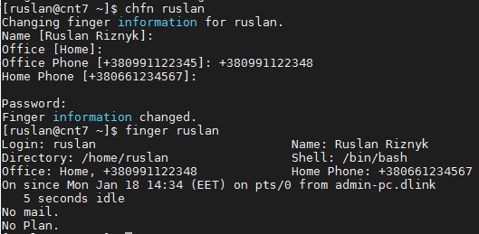
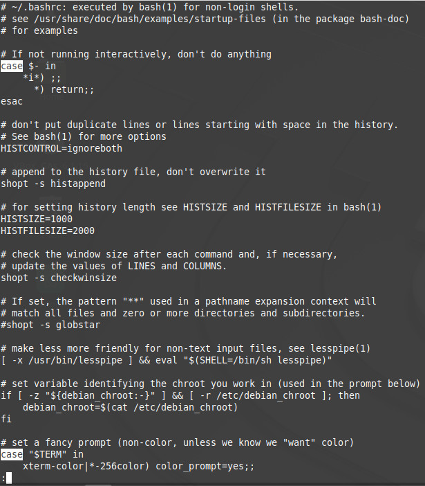
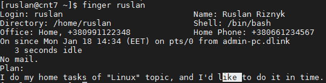
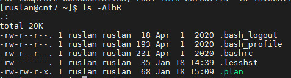
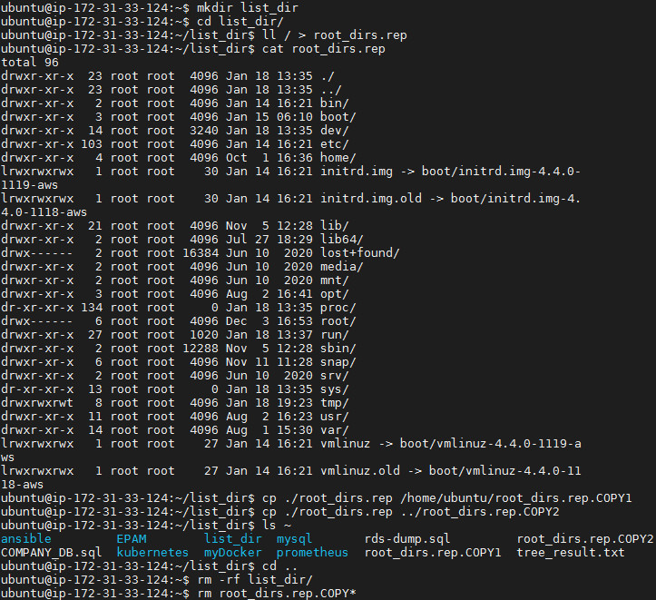
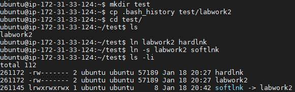
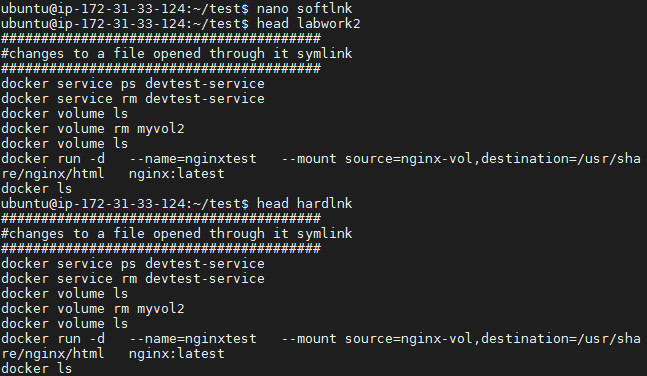
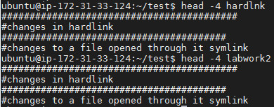
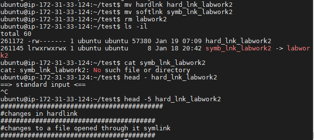

### Task1.Part1  

##### 1. Log in to the system as root  
```
ruslan:~/$ sudo -i
enter password: *******
```

##### 2. Use the passwd command to change the password  
```
root@mint:~# passwd
Enter new UNIX password: 
Retype new UNIX password: 
passwd: password updated successfully

root@mint:~# cat /etc/shadow | head -1
root:$6$KLAnwdBx$r2ZF4GD7ovCVDtk/cM2xq1efhTSRbkSXAGczcDd4vuIgAV8MrPhLgNqEnHIO5.5gtkfSXyuW6219lIuT08VoB0:18644:0:99999:7:::
```
The "passwd"-command changes /etc/shadow file.  

##### 3. Determine the users registered in the system, as well as what commands they execute.  
```
root@mint:~# w 
22:10:06 up 21 min,  3 users,  load average: 0,52, 0,65, 0,77
USER     TTY      FROM             LOGIN@   IDLE   JCPU   PCPU WHAT
ruslan   tty1     -                21:50   19:45   0.34s  0.26s -bash
ruslan   tty7     :0               21:50   21:18  24.99s  1.06s cinnamon-session --
olexandr tty2     -                22:07    1:17   0.84s  0.67s top
```
We can get information about active sessions of all users, which virtual consoles they are using, the time when they logged in, uptime (how long the system has been running, load average)  

##### 4. Change personal information about myself  

  

##### 5. Linux help system and the man and info commands  
```
root@mint:~# info sudo

sudo, sudoedit — execute a command as another user  
-i, --login
                 Run the shell specified by the target user's password data‐
                 base entry as a login shell.  This means that login-specific
                 resource files such as .profile or .login will be read by
                 the shell.  If a command is specified, it is passed to the
                 shell for execution via the shell's -c option.  If no com‐
                 mand is specified, an interactive shell is executed.  sudo
                 attempts to change to that user's home directory before run‐
                 ning the shell.  The command is run with an environment sim‐
                 ilar to the one a user would receive at log in.  The Command
                 environment section in the sudoers(5) manual documents how
                 the -i option affects the environment in which a command is
                 run when the sudoers policy is in use.  
-s, --shell
                 Run the shell specified by the SHELL environment variable if
                 it is set or the shell specified by the invoking user's
                 password database entry.  If a command is specified, it is
                 passed to the shell for execution via the shell's -c option.
                 If no command is specified, an interactive shell is exe‐
                 cuted.  

root@mint:~# man passwd

passwd - change user password  
-d, --delete
           Delete a user's password (make it empty). This is a quick way to
           disable a password for an account. It will set the named account
           passwordless.  
-S, --status
           Display account status information. The status information
           consists of 7 fields. The first field is the user's login name.
           The second field indicates if the user account has a locked
           password (L), has no password (NP), or has a usable password (P).
           The third field gives the date of the last password change. The
           next four fields are the minimum age, maximum age, warning period,
           and inactivity period for the password. These ages are expressed
           in days.
```

##### 6. "more"- and "less"-commands  

  

##### 7. Describe in plans  

  

##### 8. List the contents of the home directory  

  


### Task1.Part2  

##### 1.Examine the tree command  

```
ubuntu@ip-172-31-33-124:~$ tree -aP '*c*' -L 2 --prune
.
├── ansible
│   └── ansible.cfg
├── .aws
│   ├── config
│   ├── credentials
│   ├── credentials.save
│   └── .credentials.swp
├── .bashrc
├── EPAM
│   ├── iam_security-credentials_sc2-ec2-banking.txt
│   ├── identity-credentials_ec2_security-credentials_ec2-instance.txt
│   ├── Policy.json
│   └── public_key
├── .gitconfig
├── .kube
│   ├── config
│   └── config.eksctl.lock
├── kubernetes
│   └── kubectl
├── myDocker
│   └── Dockerfile
├── mysql
│   └── mysql-apt-config_0.8.16-1_all.deb
├── prometheus
│   ├── node_exporter.service
│   └── prometheus.service
├── .ssh
│   └── mcdzk-frankfurt-key.pem
└── .sudo_as_admin_successful

9 directories, 20 files
```
ubuntu@ip-172-31-33-124:~$ tree -aP '*yml'  --prune
.
├── ansible
│   ├── kube-cluster
│   │   ├── kube-dependencies.yml
│   │   ├── master.yml
│   │   └── vars.yml
│   ├── playbook_ADV1.yml
│   ├── playbook_ADV2.yml
│   ├── playbook_ADV3.yml
│   ├── playbook_ADV5.yml
│   ├── playbook_ADV6.yml
│   ├── playbookloop.yml
│   ├── playbook.roles.yml
│   ├── playbook.template.yml
│   ├── playbook_uninstK8S_n4.yml
│   └── roles
│       └── deploy_apache_web
│           ├── defaults
│           │   └── main.yml
│           ├── handlers
│           │   └── main.yml
│           ├── meta
│           │   └── main.yml
│           ├── tasks
│           │   └── main.yml
│           ├── tests
│           │   └── test.yml
│           ├── .travis.yml
│           └── vars
│               └── main.yml
├── kubernetes
│   └── 04_Lesson
│       ├── mycluster.yml
│       └── pod.yml
└── myDocker
    └── slurm_school
        ├── 03_Lecture
        │   ├── docker-compose.production.yml
        │   ├── docker-compose.test.yml
        │   ├── docker-compose.yml
        │   └── gitlab_ci
        │       ├── docker-compose.production.yml
        │       ├── docker-compose.test.yml
        │       ├── docker-compose.yml
        │       └── .gitlab-ci.yml
        └── docker-compose.yml

16 directories, 29 files
```

ubuntu@ip-172-31-33-124:~$ tree -dL 2
```

##### 2. What command can be used to determine the type of file  

```
[ruslan@cnt7 ~]$ file .plan
.plan: ASCII text

file /bin/ls
/bin/ls: ELF 64-bit LSB executable, x86-64, version 1 (SYSV), dynamically linked, interpreter /lib64/ld-linux-x86-64.so.2, for GNU/Linux 2.6.32, BuildID[sha1]=d0bc0fb9b3f60f72bbad3c5a1d24c9e2a1fde775, stripped
```

##### 3.  Master the skills of navigating the file system  

```
cd /home/ubuntu
cd $HOME
cd /home/$USER
cd
cd ~
cd -
```

##### 4. "ls" - command  

```
ubuntu@ip-172-31-33-124:~$ ls
ansible         EPAM        myDocker  prometheus    tree_result.txt
COMPANY_DB.sql  kubernetes  mysql     rds-dump.sql

ubuntu@ip-172-31-33-124:~$ ls -a   #show all files and directories included hidden
.              .boto           .lesshst        rds-dump.sql
..             .cache          .local          .ssh
ansible        COMPANY_DB.sql  myDocker        .sudo_as_admin_successful
.ansible       .config         mysql           tree_result.txt
.aws           EPAM            .mysql_history  .viminfo
.bash_history  .gitconfig      .nano           .wget-hsts
.bash_logout   .kube           .profile        .Xauthority
.bashrc        kubernetes      prometheus

ubuntu@ip-172-31-33-124:~$ ls -l  # wide list format
total 64
drwxrwxr-x 8 ubuntu ubuntu  4096 Jan 14 16:37 ansible
-rw-rw-r-- 1 ubuntu ubuntu  4508 Dec 24 23:46 COMPANY_DB.sql
drwxrwxr-x 3 ubuntu ubuntu  4096 Dec 20 07:56 EPAM
drwxrwxr-x 3 ubuntu ubuntu  4096 Oct 17 15:26 kubernetes
drwxrwxr-x 6 ubuntu ubuntu  4096 Sep 22 15:56 myDocker
drwxrwxr-x 2 ubuntu ubuntu  4096 Dec 25 01:04 mysql
drwxrwxr-x 4 ubuntu ubuntu  4096 Dec  4 17:40 prometheus
-rw-rw-r-- 1 ubuntu ubuntu  5077 Dec 25 00:58 rds-dump.sql
-rw-rw-r-- 1 ubuntu ubuntu 21817 Jan 18 13:43 tree_result.txt
```

##### 5.  

  

##### 6. Hard and soft links  

  

Inode address and file permissions of the original file and its symlink are different, in addition, it is clearly shown that this is a Linux symlink. Inode address and file permissions of the file and its hard link are the same.  

  

When we open the link, the target file or folder opens and we make changes in the original file and its hardlinks.  

  

Rename symlink and hardlink, remove original file  

  

 After renaming "symb_lnk_labwork2" still works as a symlink its file  "labwork2". After deleting the original file, if we want to open its link, we will receive an error that such a file does not exist, because we really deleted the original file. It only refers to the file name, not its content. A hard link still points to the same section of the disk; this is the main difference between a hard link and a symbolic one. Linux hardlink is a regular file.  

##### 7. "locate" utility  

```
ubuntu@ip-172-31-33-124:/$ sudo updatedb
ubuntu@ip-172-31-33-124:/$ locate -Ab squid
/usr/share/sosreport/sos/plugins/squid.py
/usr/share/sosreport/sos/plugins/__pycache__/squid.cpython-35.pyc
/usr/share/vim/vim74/syntax/squid.vim
ubuntu@ip-172-31-33-124:/$ locate -Ab traceroute
/etc/alternatives/traceroute6
/etc/alternatives/traceroute6.8.gz
/usr/bin/traceroute6
/usr/bin/traceroute6.iputils
/usr/share/man/man8/traceroute6.8.gz
/usr/share/man/man8/traceroute6.iputils.8.gz
/var/lib/dpkg/alternatives/traceroute6
ubuntu@ip-172-31-33-124:/$ locate -Ab squid traceroute
ubuntu@ip-172-31-33-124:/$
```

##### 8. Mount partitions  

```
[ruslan@cnt7 ssh]$ df -h
Filesystem               Size  Used Avail Use% Mounted on
devtmpfs                 485M     0  485M   0% /dev
tmpfs                    496M     0  496M   0% /dev/shm
tmpfs                    496M  6.8M  489M   2% /run
tmpfs                    496M     0  496M   0% /sys/fs/cgroup
/dev/mapper/centos-root  6.2G  1.6G  4.7G  26% /
/dev/sda1               1014M  196M  819M  20% /boot
tmpfs                    100M     0  100M   0% /run/user/0
tmpfs                    100M     0  100M   0% /run/user/1000
```
</dev/mapper/centos-root>, </dev/sda1> - basic filesystem  
<devtmpfs>, <tmpfs> - special filesystems  

##### 9. 