## Task 5.3  

### Part1  

#### 1. How many states could has a process in Linux?  

Basically, there are Five main process states - Running (R), Interruptible sleep (S) - process is waiting for some event, Stop (T) - process is stopped, Zombie (Z) - state between (exit) and (wait) , Uninterruptible sleep (D) - process is waiting for input-output after it's requested somewhere.  

#### 2. Examine the pstree command.  
```
buntu@ip-172-31-33-124:~$ pstree
systemd─┬─accounts-daemon─┬─{gdbus}
        │                 └─{gmain}
        ├─acpid
        ├─2*[agetty]
        ├─amazon-ssm-agen─┬─ssm-agent-worke───8*[{ssm-agent-worke}]
        │                 └─7*[{amazon-ssm-agen}]
        ├─atd
        ├─containerd───8*[{containerd}]
        ├─cron
        ├─dbus-daemon
        ├─dhclient
        ├─dockerd─┬─docker-containe─┬─docker-containe─┬─docker-volume-s───3*[{docker-volume-s}]
        │         │                 │                 └─8*[{docker-containe}]
        │         │                 └─9*[{docker-containe}]
        │         └─12*[{dockerd}]
        ├─gitlab-runner───7*[{gitlab-runner}]
        ├─2*[iscsid]
        ├─lvmetad
        ├─lxcfs───10*[{lxcfs}]
        ├─mdadm
        ├─mysqld─┬─36*[{mysqld}]
        │        ├─{xpl_worker0}
        │        └─{xpl_worker1}
        ├─node_exporter───3*[{node_exporter}]
        ├─polkitd─┬─{gdbus}
        │         └─{gmain}
        ├─rsyslogd─┬─{in:imklog}
        │          ├─{in:imuxsock}
        │          └─{rs:main Q:Reg}
        ├─snapd───8*[{snapd}]
        ├─sshd─┬─sshd───sshd───bash───pstree
        │      └─sshd───sshd───sftp-server
        ├─systemd───(sd-pam)
        ├─systemd-journal
        ├─systemd-logind
        ├─systemd-timesyn───{sd-resolve}
        ├─systemd-udevd
        └─unattended-upgr───{gmain}

ubuntu@ip-172-31-33-124:~$ pstree -h | grep bash
        |-sshd-+-sshd---sshd---bash-+-grep
```

#### 3. What is a proc file system?  
The filesystem /proc stores information about processes on the OS.  

#### 4. Print information about the processor  
```
ubuntu@ip-172-31-33-124:~$ lscpu
Architecture:          x86_64
CPU op-mode(s):        32-bit, 64-bit
Byte Order:            Little Endian
CPU(s):                1
On-line CPU(s) list:   0
Thread(s) per core:    1
Core(s) per socket:    1
Socket(s):             1
NUMA node(s):          1
Vendor ID:             GenuineIntel
CPU family:            6
Model:                 63
Model name:            Intel(R) Xeon(R) CPU E5-2676 v3 @ 2.40GHz
Stepping:              2
CPU MHz:               2400.082
BogoMIPS:              4800.16
Hypervisor vendor:     Xen
Virtualization type:   full
L1d cache:             32K
L1i cache:             32K
L2 cache:              256K
L3 cache:              30720K
```

#### 5. Use the ps command to get information about the process  
```
ps -e --format="pid ppid uname cmd group %cpu %mem stat" | head
  PID  PPID USER     CMD                         GROUP    %CPU %MEM STAT
    1     0 root     /sbin/init                  root      0.0  0.5 Ss
    2     0 root     [kthreadd]                  root      0.0  0.0 S
    3     2 root     [ksoftirqd/0]               root      0.0  0.0 S
    5     2 root     [kworker/0:0H]              root      0.0  0.0 S<
    6     2 root     [kworker/u30:0]             root      0.0  0.0 S
    7     2 root     [rcu_sched]                 root      0.0  0.0 S
    8     2 root     [rcu_bh]                    root      0.0  0.0 S
    9     2 root     [migration/0]               root      0.0  0.0 S
   10     2 root     [watchdog/0]                root      0.0  0.0 S
```

#### 6. How to define kernel processes and user processes?  
The kernel creates a process tree with two main branches: a process with PID(process identifier) = 2 (in ubuntu 18.04 and CenOS7 called "kthreadd") is assigned as the parent for all kernel processes; the process with PID = 1 (for example - init) is assigned as the parent for all user processes. We can see the names of kernel processes between square brackets when we call the "ps aux" command.  

#### 7. Print the list of processes to the terminal. Briefly describe the statuses of the processes.  
```
ubuntu@ip-172-31-33-124:~$ ps aux
USER       PID %CPU %MEM    VSZ   RSS TTY     STAT START   TIME COMMAND
root         1  0.0  0.5  37764  5188 ?        Ss   Jan22   0:05 /sbin/init
root         2  0.0  0.0      0     0 ?        S    Jan22   0:00 [kthreadd]
root         3  0.0  0.0      0     0 ?        S    Jan22   0:01 [ksoftirqd/0]
root         5  0.0  0.0      0     0 ?        S<   Jan22   0:00 [kworker/0:0H]
................................................................................
root        19  0.0  0.0      0     0 ?        SN   Jan22   0:00 [ksmd]
root        20  0.0  0.0      0     0 ?        SN   Jan22   0:00 [khugepaged]
................................................................................
systemd+   723  0.0  0.2 100320  2208 ?        Ssl  Jan22   0:00 /lib/systemd/systemd-timesyncd
root      1218  0.0  0.9 138840  9796 ?        Ssl  Jan22   1:27 /usr/bin/gitlab-runner run --working-directory /home/gitla
root      1219  0.0  0.0   5216   116 ?        Ss   Jan22   0:12 /sbin/iscsid
root      1220  0.0  0.3   5716  3520 ?        S<Ls Jan22   1:00 /sbin/iscsid
root      1441  0.0  0.1  14468  1712 ttyS0    Ss+  Jan22   0:00 /sbin/agetty --keep-baud 115200 38400 9600 ttyS0 vt220
root      1453  0.0  0.1  14652  1372 tty1     Ss+  Jan22   0:00 /sbin/agetty --noclear tty1 linux
mysql     1480  0.1 32.8 1296308 333008 ?      Ssl  Jan22  10:26 /usr/sbin/mysqld
root      1502  0.0  0.5 226704  5964 ?        Ssl  Jan22   5:06 docker-containerd -l unix:///var/run/docker/libcontainerd/
root      1551  0.0  0.0 207324   416 ?        Sl   Jan22   0:00 docker-containerd-shim cb594c448456313d1fa120a372933277317
................................................................................
ubuntu    8824  0.0  0.3  36080  3312 pts/0    R+   15:11   0:00 ps aux
root     12587  0.0  0.0      0     0 ?        S    Jan23   0:05 [kworker/0:1]
root     23680  0.0  0.0      0     0 ?        S    02:55   0:00 [kworker/u30:1]
root     26128  0.0  0.0      0     0 ?        S    Jan28   0:00 [kworker/u30:2]
root     30670  0.0  0.0      0     0 ?        S<   Jan28   0:00 [xfsalloc]
root     30671  0.0  0.0      0     0 ?        S<   Jan28   0:00 [xfs_mru_cache]
```
Statuses (STAT)  
- S - process is sleeping
- R - process that is running or in the queue
- s - process is the session leader
- < - process has high priority
- N - process has low priority
- L - some pages are locked in memory
- + - process group in the background
- l - multi-threading process  

#### 8. Display only the processes of a specific user  
List of "ubuntu"-user processes  
```
ubuntu@ip-172-31-33-124:~$ ps -fu ubuntu
UID        PID  PPID  C STIME TTY          TIME CMD
ubuntu    6518     1  0 13:28 ?        00:00:00 /lib/systemd/systemd --user
ubuntu    6521  6518  0 13:28 ?        00:00:00 (sd-pam)
ubuntu    6703  6516  0 13:28 ?        00:00:00 sshd: ubuntu@notty
ubuntu    6704  6514  0 13:28 ?        00:00:00 sshd: ubuntu@pts/0
ubuntu    6709  6703  0 13:28 ?        00:00:00 /usr/lib/openssh/sftp-server
ubuntu    6711  6704  0 13:28 pts/0    00:00:00 -bash
ubuntu   11295  6711  0 16:41 pts/0    00:00:00 ps -fu ubuntu
```

#### 9. What utilities can be used to analyze existing running tasks (by analyzing the help for the ps command)?  
- "pgrep" utility was created to removing the need to call grep with ps.  
```
ubuntu@ip-172-31-33-124:~$ pgrep docker -l
1227 dockerd
1502 docker-containe
1551 docker-containe
1572 docker-volume-s
```
- "pkill" - command pkill is similar to pgrep in that it can search by name and will send the specified signal (by default SIGTERM) to each process.  
```
ubuntu@ip-172-31-33-124:~$ sudo pkill docker
ubuntu@ip-172-31-33-124:~$ pgrep docker -l
ubuntu@ip-172-31-33-124:~$
```
- pidof. This command will check the PID of a specific binary even if another process with the same name is running  

#### 10. What information does top command display?  
The top command is using for real-time viewing details of running processes and quickly identifying issues with memory, CPU, etc.  

#### 11. Display the processes of the specific user using the top command  

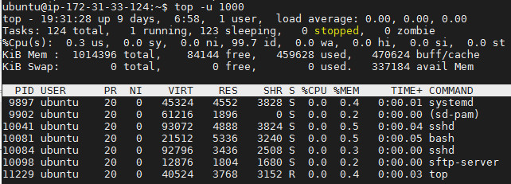  

#### 12. What interactive commands can be used to control the top command?  

We can see help menu for interactive commands when press "h"or "?"  

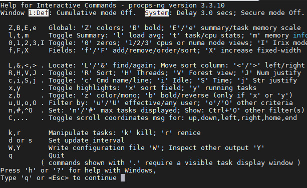  

- Toggle alternate display mode. We need to press "A" key to display four windows, each displaying a field group: Def: sorted by %CPU, Job: sorted by PID, Mem: sorted by %MEM, Usr: sorted by User field. With g command, we can enter a number to select the current window.  

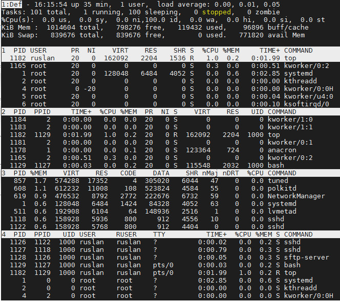  

- l, t and m keys will toggle load average, task/cpu status and mem info respectively as discussed in Uptime and Load Average, CPU State and Memory Usage.  

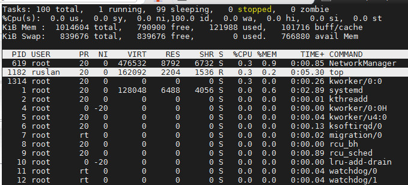  

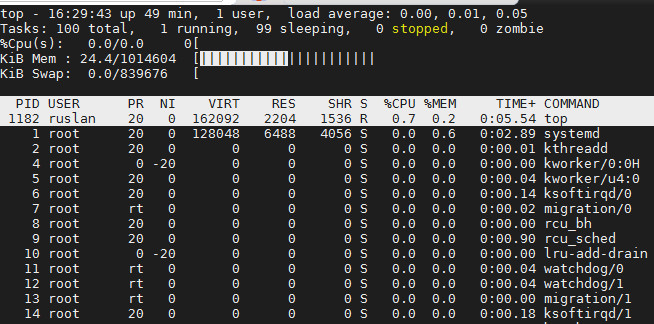  

- F key used to choose what field we want to display on the output screen.  

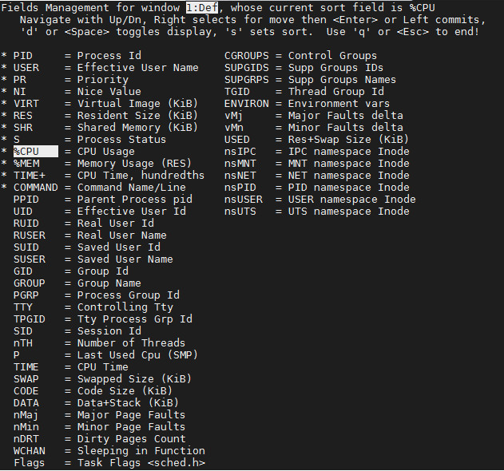  

- c displays the full command path along with the command line arguments in the COMMAND column  

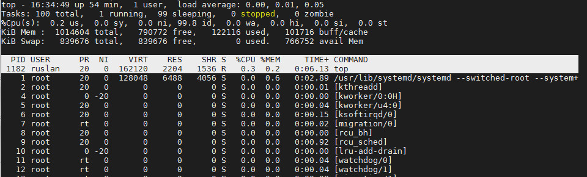  

#### 13. 
By default "top" sorts processes by CPU loading. We can use Shift+N — to sort by PID, Shift+P— sort by CPU usage, Shift+M — sort by Memory usage, Shift+T — sort by Time usage.
Also we can use  SHIFT+> and SHIFT+< to sort descending by CPU loading, memory, PID, etc.  

We can see which process load CPU mostly   
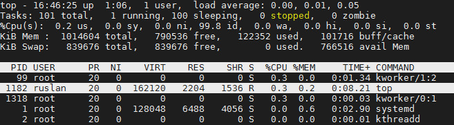  

#### 14.  Concept of priority, what commands are used to set priority  

Processes can have such range of priority on linux - from -20 to 19. Priority "-20" means that tasks with this value will be executed first of all. And tasks with priority "19" will be executed with minimal resources.  
We can define the priority of process that is going to run using command "nice".  
```
ubuntu@ip-172-31-33-124:~$ nice -n 15 sleep 500 &
[1] 16766
ubuntu@ip-172-31-33-124:~$ ps -eo pid,user,nice,comm | grep sleep
16766 ubuntu    15 sleep
ubuntu@ip-172-31-33-124:~$ nice -n -15 sleep 5000 &
[2] 16829
ubuntu@ip-172-31-33-124:~$ nice: cannot set niceness: Permission denied
^C
ubuntu@ip-172-31-33-124:~$ sudo !!
sudo nice -n -15 sleep 5000 &
[3] 16843
ubuntu@ip-172-31-33-124:~$ ps -eo pid,user,nice,comm | grep sleep
16766 ubuntu    15 sleep
16829 ubuntu     0 sleep
16844 root     -15 sleep
# if we want to set priority higher than system sets as default - "0", we need  root-privileges
# if we want to reset priority of running process, we need to call "renice"-command
ubuntu@ip-172-31-33-124:~$ nice -n 15 sleep 50000 &
[5] 17074
ubuntu@ip-172-31-33-124:~$ sudo renice 5 -p 17074
17074 (process ID) old priority 15, new priority 5
ubuntu@ip-172-31-33-124:~$ ps -eo pid,user,nice,comm | grep sleep
16829 ubuntu     0 sleep
16844 root     -15 sleep
17066 ubuntu     0 sleep
17074 ubuntu     5 sleep
# or for specific user
ubuntu@ip-172-31-33-124:~$ sudo renice 15 -u mysql
114 (user ID) old priority 0, new priority 15
```

#### 15. Can I change the priority of a process using the top command? If so, how?  

The "r" option of the "top" is used to change the priority of the process. Is the similar of the "renice"-command. In our case we press "sudo top" ->  "r" -> [PID] -> [new value of priority].  

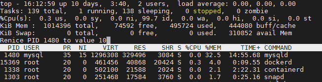  

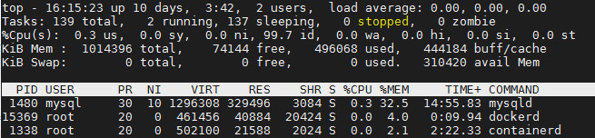  

#### 16. Examine the kill command  
"kill" sends termination(stop) signal to process. The most commonly used signal is "terminate": (SIGTERM) - "soft" form of stopping is default when we call that command or "kill -15", (SIGKILL) - "hard" unconditional stopping - "kill -9". There are other subkinds of "kill", for example kill -2(SIGINT - interrupt) the same as Ctrl+C.  
```
ubuntu@ip-172-31-33-124:~$ kill -l
 1) SIGHUP       2) SIGINT       3) SIGQUIT      4) SIGILL       5) SIGTRAP
 6) SIGABRT      7) SIGBUS       8) SIGFPE       9) SIGKILL     10) SIGUSR1
11) SIGSEGV     12) SIGUSR2     13) SIGPIPE     14) SIGALRM     15) SIGTERM
16) SIGSTKFLT   17) SIGCHLD     18) SIGCONT     19) SIGSTOP     20) SIGTSTP
21) SIGTTIN     22) SIGTTOU     23) SIGURG      24) SIGXCPU     25) SIGXFSZ
26) SIGVTALRM   27) SIGPROF     28) SIGWINCH    29) SIGIO       30) SIGPWR
31) SIGSYS      34) SIGRTMIN    35) SIGRTMIN+1  36) SIGRTMIN+2  37) SIGRTMIN+3
38) SIGRTMIN+4  39) SIGRTMIN+5  40) SIGRTMIN+6  41) SIGRTMIN+7  42) SIGRTMIN+8
43) SIGRTMIN+9  44) SIGRTMIN+10 45) SIGRTMIN+11 46) SIGRTMIN+12 47) SIGRTMIN+13
48) SIGRTMIN+14 49) SIGRTMIN+15 50) SIGRTMAX-14 51) SIGRTMAX-13 52) SIGRTMAX-12
53) SIGRTMAX-11 54) SIGRTMAX-10 55) SIGRTMAX-9  56) SIGRTMAX-8  57) SIGRTMAX-7
58) SIGRTMAX-6  59) SIGRTMAX-5  60) SIGRTMAX-4  61) SIGRTMAX-3  62) SIGRTMAX-2
63) SIGRTMAX-1  64) SIGRTMAX

#kill -15 [PID]
#for example
ubuntu@ip-172-31-33-124:~$ sleep 9000 &
[1] 3240
ubuntu@ip-172-31-33-124:~$ kill -9 3240
ubuntu@ip-172-31-33-124:~$ sleep 9000 &
[2] 3260
[1]   Killed                  sleep 9000

ubuntu@ip-172-31-33-124:~$ dd if=/dev/zero of=/dev/null &
[3] 3325
ubuntu@ip-172-31-33-124:~$ dd if=/dev/zero of=/dev/null &
[4] 3370
ubuntu@ip-172-31-33-124:~$ dd if=/dev/zero of=/dev/null &
[5] 3371
ubuntu@ip-172-31-33-124:~$ ps aux | grep dd
root         2  0.0  0.0      0     0 ?        S    Jan22   0:00 [kthreadd]
root        84  0.0  0.0      0     0 ?        S<   Jan22   0:00 [ipv6_addrconf]
root       388  0.0  0.0      0     0 ?        S<   Jan22   0:00 [ib_addr]
message+  1257  0.0  0.2  42884  2944 ?        Ss   Jan22   0:00 /usr/bin/dbus-daemon --system --ad ress=systemd: --nofork --nopidfile --systemd-activation
ubuntu    3325 97.8  0.0   6044   840 pts/0    R    05:36   2:37 dd if=/dev/zero of=/dev/null
ubuntu    3370 37.0  0.0   6044   692 pts/0    R    05:38   0:01 dd if=/dev/zero of=/dev/null
ubuntu    3371 35.0  0.0   6044   740 pts/0    R    05:38   0:00 dd if=/dev/zero of=/dev/null
ubuntu    3373  0.0  0.0  12940  1012 pts/0    S+   05:39   0:00 grep --color=auto dd
ubuntu@ip-172-31-33-124:~$ ps fax | grep -B5 dd
  PID TTY      STAT   TIME COMMAND
    2 ?        S      0:00 [kthreadd]
--
   75 ?        S      0:00  \_ [scsi_eh_0]
   76 ?        S<     0:00  \_ [scsi_tmf_0]
   77 ?        S      0:00  \_ [scsi_eh_1]
   78 ?        S<     0:00  \_ [scsi_tmf_1]
   80 ?        S<     0:00  \_ [bioset]
   84 ?        S<     0:00  \_ [ipv6_addrconf]
--
  280 ?        S<     0:00  \_ [bioset]
  301 ?        S      0:01  \_ [jbd2/xvda1-8]
  302 ?        S<     0:00  \_ [ext4-rsv-conver]
  362 ?        S<     0:00  \_ [kworker/0:1H]
  381 ?        S<     0:00  \_ [iscsi_eh]
  388 ?        S<     0:00  \_ [ib_addr]
--
 1220 ?        S<Ls   1:32 /sbin/iscsid
 1231 ?        Ss     0:00 /usr/sbin/atd -f
 1236 ?        Ssl    0:02 /usr/sbin/rsyslogd -n
 1237 ?        Ssl    0:04 /usr/bin/lxcfs /var/lib/lxcfs/
 1247 ?        Ssl    0:00 /usr/local/bin/node_exporter
 1257 ?        Ss     0:00 /usr/bin/dbus-daemon --system --address=systemd: --nofork --nopidfile --systemd-activation
--
 1375 ?        Ss     0:04 /usr/sbin/sshd -D
 2721 ?        Ss     0:00  \_ sshd: ubuntu [priv]
 2885 ?        S      0:00  |   \_ sshd: ubuntu@pts/0
 2910 pts/0    Ss     0:00  |       \_ -bash
 3260 pts/0    S      0:00  |           \_ sleep 9000
 3325 pts/0    R      3:10  |           \_ dd if=/dev/zero of=/dev/null
 3370 pts/0    R      0:34  |           \_ dd if=/dev/zero of=/dev/null
 3371 pts/0    R      0:33  |           \_ dd if=/dev/zero of=/dev/null
 3402 pts/0    R+     0:00  |           \_ ps fax
ubuntu@ip-172-31-33-124:~$ kill -9 2910
```

#### 17. Commands jobs, fg, bg, nohup  

- "jobs" - shows us information about commands which is running on the current session (terminal) as usually on the background.
- "nohup" - theoretical allows continue processes after log out or closing our terminal.
- "fg" - returns process from the background to active terminal.
- "bg" - sends processes to background.
```
[ruslan@cnt7 ~]$ sleep 5000 &
[1] 1731
[ruslan@cnt7 ~]$ sleep 6000 &
[2] 1732
[ruslan@cnt7 ~]$ yes > /dev/null 2>&1 &
[3] 1733
[ruslan@cnt7 ~]$ jobs
[1]   Running                 sleep 5000 &
[2]-  Running                 sleep 6000 &
[3]+  Running                 yes > /dev/null 2>&1 &
[ruslan@cnt7 ~]$ ps aux | tail
ruslan    1703  0.0  0.0 108056   352 ?        S    23:19   0:00 sleep 6000
root      1705  0.0  0.2  96572  2452 ?        Ss   23:20   0:00 login -- ruslan
ruslan    1710  0.0  0.2 115548  2032 tty1     Ss+  23:20   0:00 -bash
ruslan    1731  0.0  0.0 108056   356 pts/1    S    23:21   0:00 sleep 5000
ruslan    1732  0.0  0.0 108056   356 pts/1    S    23:21   0:00 sleep 6000
ruslan    1733 99.9  0.0 108060   352 pts/1    R    23:22   6:57 yes
root      1736  0.0  0.0      0     0 ?        S    23:27   0:00 [kworker/1:0]
ruslan    1741 82.8  0.0 108060   356 tty1     S    23:27   1:08 yes
ruslan    1742  0.0  0.1 155452  1800 pts/1    R+   23:29   0:00 ps aux
ruslan    1743  0.0  0.0 115548   632 pts/1    R+   23:29   0:00 -bash
[ruslan@cnt7 ~]$ kill 1733
[ruslan@cnt7 ~]$ yes > /dev/null 2>&1 &
[4] 1746
[3]   Terminated              yes > /dev/null 2>&1
[ruslan@cnt7 ~]$ jobs
[1]   Running                 sleep 5000 &
[2]-  Running                 sleep 6000 &
[4]+  Running                 yes > /dev/null 2>&1 &
[ruslan@cnt7 ~]$ fg %1
sleep 5000
^Z
[1]+  Stopped                 sleep 5000
[ruslan@cnt7 ~]$ bg %1
[1]+ sleep 5000 &
[ruslan@cnt7 ~]$ jobs
[1]   Running                 sleep 5000 &
[2]-  Running                 sleep 6000 &
[4]+  Running                 yes > /dev/null 2>&1 &
[ruslan@cnt7 ~]$ kill %2
[ruslan@cnt7 ~]$ jobs
[1]   Running                 sleep 5000 &
[2]-  Terminated              sleep 6000
[4]+  Running                 yes > /dev/null 2>&1 &
```

### Part2  

#### 1. Check the implementability of the most frequently used OPENSSH commands in the MS Windows operating system  

Consider installing OpenSSH on Windows-7. 
I'll use manuals http://fred151.net/site/2018/09/23/how-to-install-openssh-on-windows-7-10/ and https://github.com/PowerShell/Win32-OpenSSH/wiki/Install-Win32-OpenSSH  
1.1 Download the latest (https://github.com/PowerShell/Win32-OpenSSH/releases/latest) build of OpenSSH - v8.1.0.0p1-Beta.
1.2 Extract contents of the latest build to C:\Program Files\OpenSSH
1.3 Download PsTools (official useful tools from Microsoft https://docs.microsoft.com/en-us/sysinternals/downloads/pstools). Copy the content of the folder PSTools under “C:\Windows\System32\”. Open the cmd as administrator and run C:\Windows\System32\psexec64.exe, accept the eula license.
1.4 In an elevated Powershell console, run the following
```
powershell.exe -ExecutionPolicy Bypass -File install-sshd.ps1
```
1.5 Allow incoming connections to SSH server in Windows Firewall:
– Either run the following PowerShell command (Windows 8 and 2012 or newer only), as the Administrator:
```
New-NetFirewallRule -Name sshd -DisplayName 'OpenSSH Server (sshd)' -Enabled True -Direction Inbound -Protocol TCP -Action Allow -LocalPort 22
```
– or go to Control Panel > System and Security > Windows Firewall> Advanced Settings > Inbound Rules and add a new rule for port 22.
1.6 Create the C:\Users\admin\.ssh folder 
1.7 Create the file “authorized_keys” under ~./.ssh
1.8 Run the scrips to fix/check correct permission a PowerShell with administrator privilege
```
> powershell.exe -ExecutionPolicy Bypass -File FixHostFilePermissions.ps1 > powershell.exe -ExecutionPolicy Bypass -File FixUserFilePermissions.ps1
```
1.9 Personalize your SSH server settings editing the configuration file %PROGRAMDATA%\ssh\sshd_config
1.10 Start sshd (this will automatically generate host keys under %programdata%\ssh if they don't already exist)
```
net start sshd
```
1.11 run ./ssh-keygen.exe to create private and puplic keys  
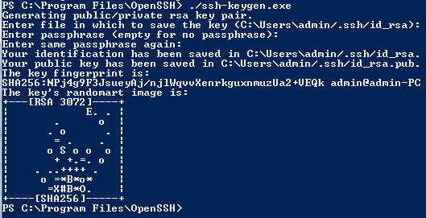  

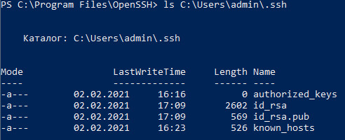  

1.12 Copy the private and public key on the ~.ssh folder of the user that you want use on the server.Run ssh-add.exe to add you private and public key to the ssh-agent.
Note: ensure that ssh-agent is running.
```
./ssh-add.exe
```
1.13 


 

    


