## Task 6.1  

#### 2. VM2 has one interface (internal), VM1 has 2 interfaces (NAT and internal).  
Configure  all network interfaces in order to make VM2 has an access to the Internet (iptables, forward, masquerade)  

```
sudo nano /etc/network/interfaces
.....................
#internal
auto enp0s8
iface enp0s8 inet static
address 10.10.10.1
netmask 255.255.255.0
broadcast 10.10.0.255
```

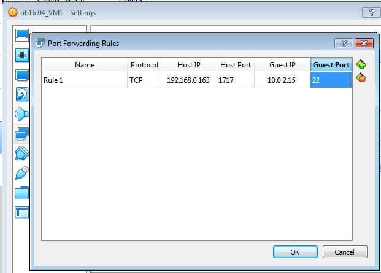  

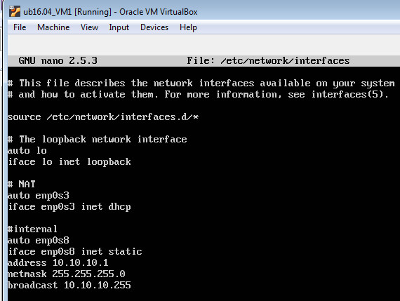  

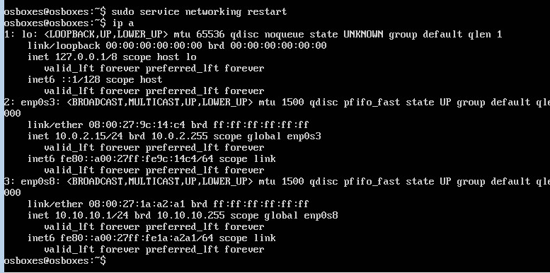  

#save changes and restart network service  
sudo systemctl networking restart  

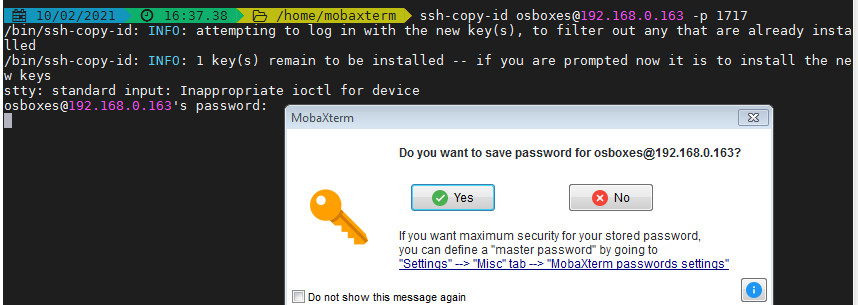 

```
# for VM2
sudo nano /etc/network/interfaces
.....................
#internal
auto enp0s3
iface enp0s3 inet static
address 10.10.10.2
netmask 255.255.255.0
broadcast 10.10.0.255
gateway 10.10.10.1
dns-nameservers 8.8.8.8
```

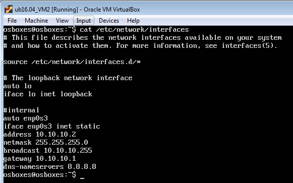  

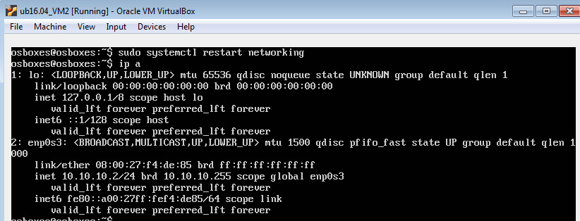  

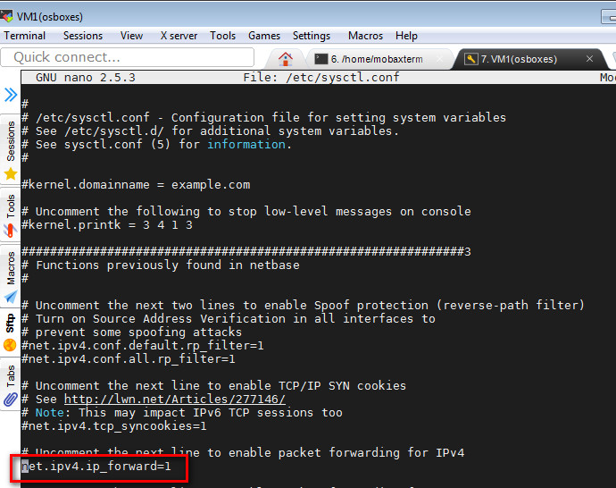  

For CentOS7 internal machine  

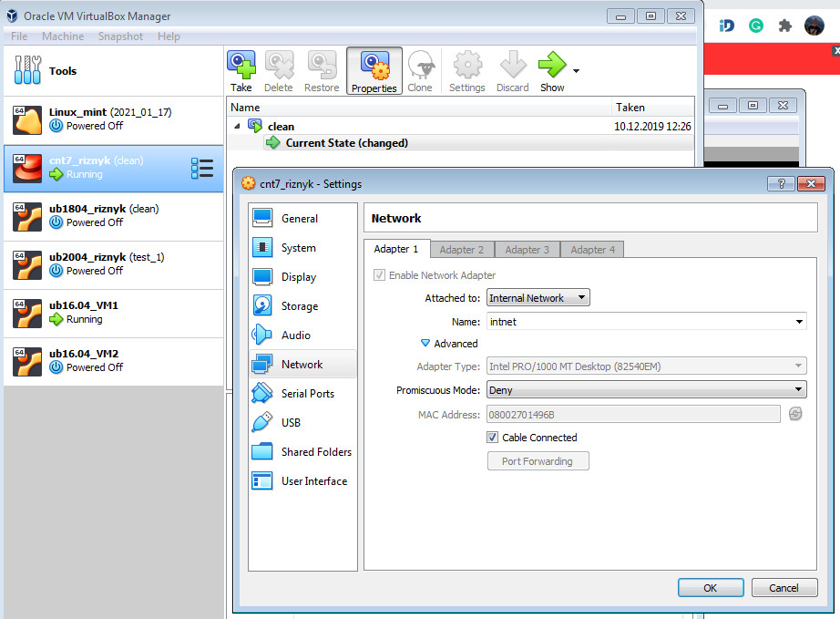  

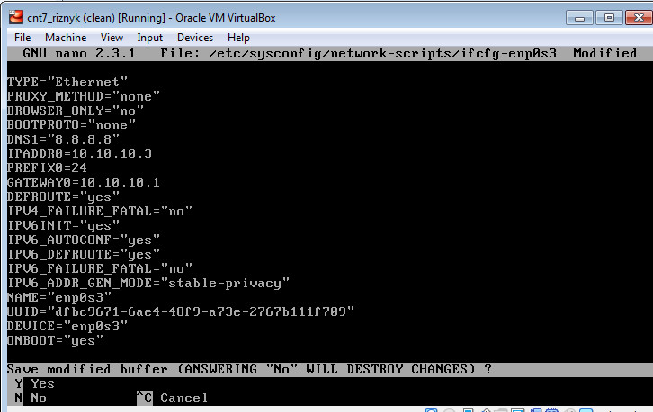  

Iptables configurig:

```
sudo iptables -t nat -A POSTROUTING -o enp0s3 -j MASQUERADE
sudo iptables -A FORWARD -i enp0s8 -o enp0s3 -m state --state RELATED,ESTABLISHED -j ACCEPT

#it can be works without
sudo iptables -A FORWARD -i enp0s8 -o enp0s3 -j ACCEPT
```

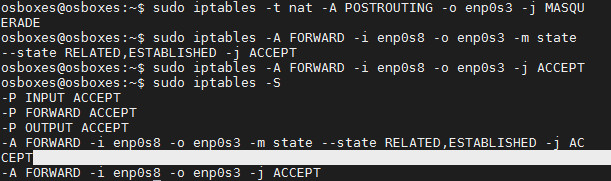  

```
#if we want the iptables rules work after reload host:
apt-get install iptables-persistent
#and agree with saving existing iptables rules
# notice - we need to restart system on VM1
```

#### 3. Check the route from VM2 to Host.  

Host-machine has IP - 192.168.0.163  

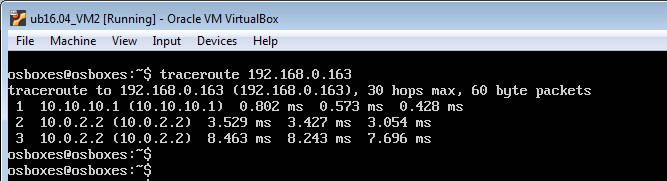  

Using "mtr"

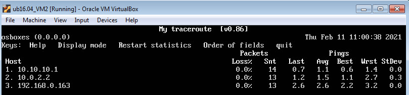  

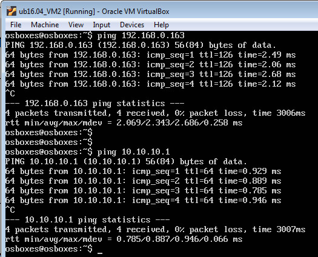  

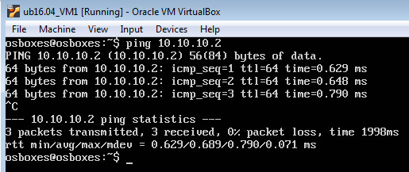  

#### 4. Check the access to the Internet, (just ping, for example, 8.8.8.8).  

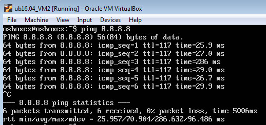  

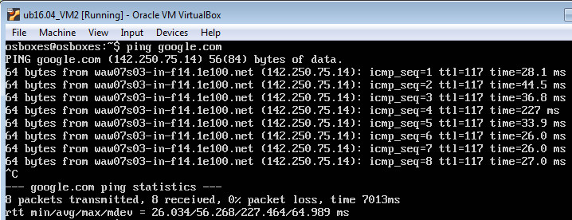  

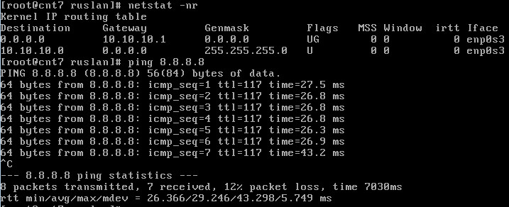  

#### 5. Determine, which  resource has an IP address 8.8.8.8.  

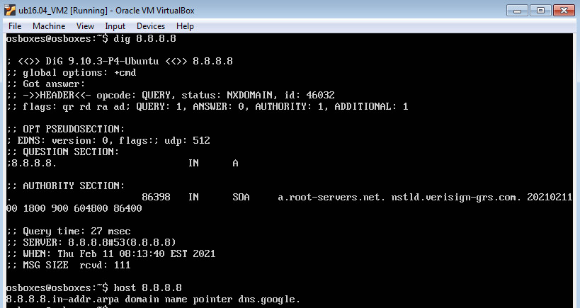  

#### 6. Determine, which  IP address belongs to resource epam.com.  

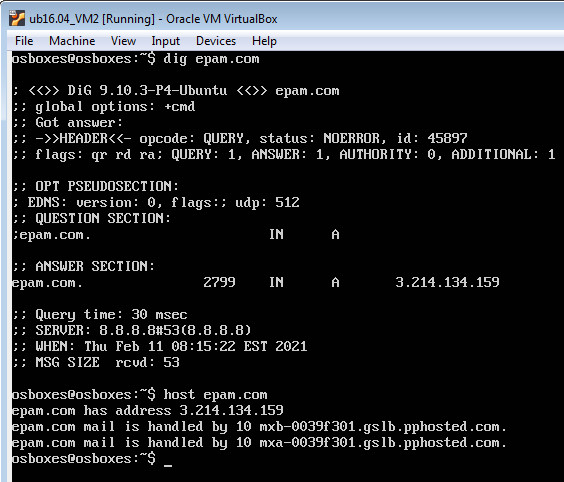  

#### 7. Determine the default gateway for your HOST and display routing table.  

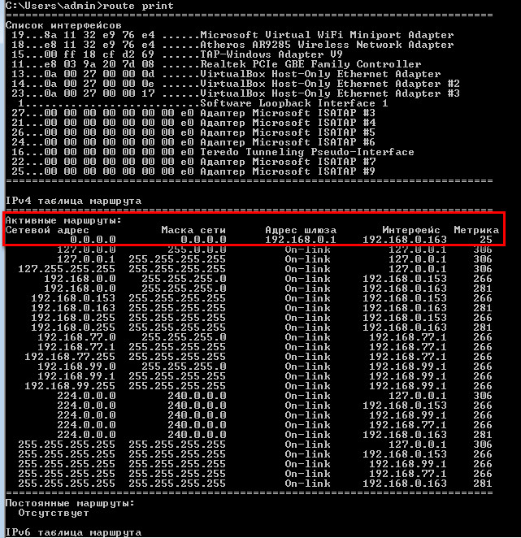  

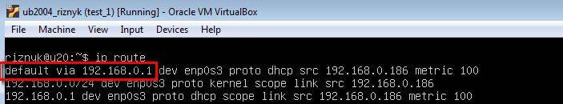  

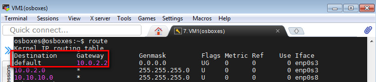  

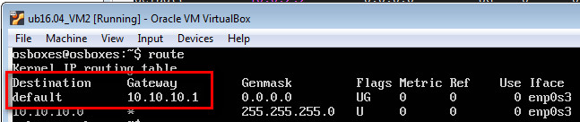  

#### 8. Trace the route to google.com  

Using "mtr" - utility

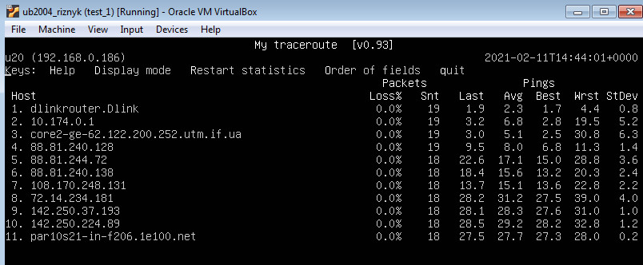  

using "traceroute"

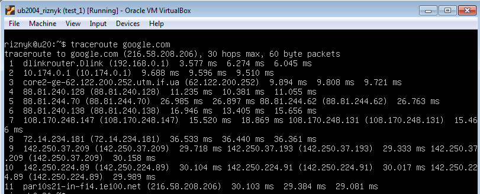  

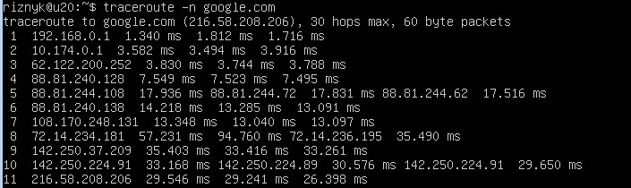  

