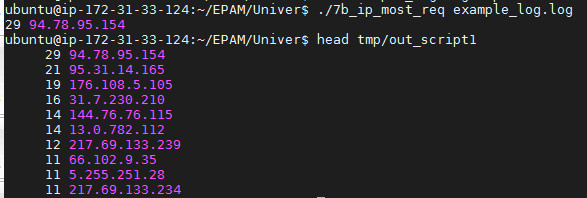
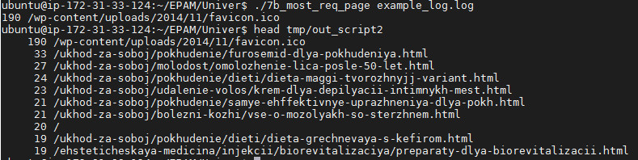
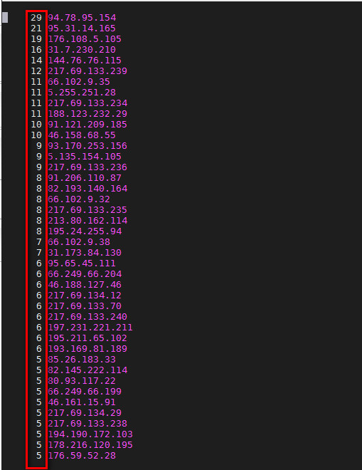
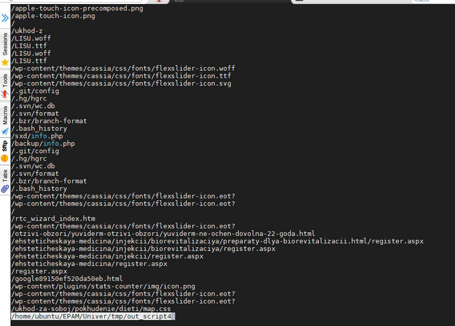
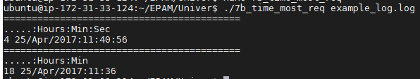
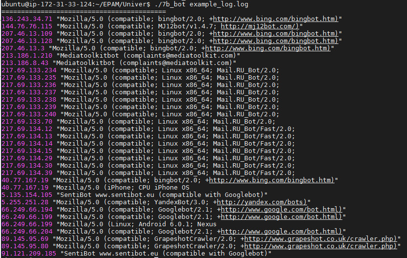
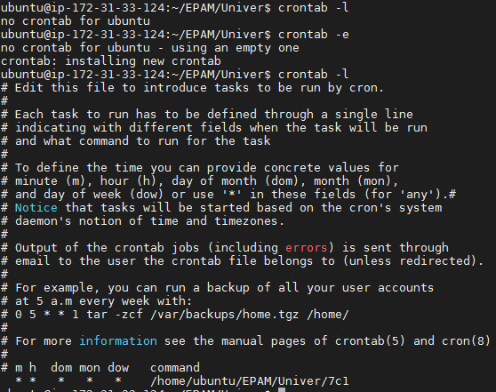

## Task. Linux administration with bash.  

#### A. Create a script that uses the following keys:  

```
#!/bin/bash

subnet_ip=`curl http://169.254.169.254/latest/meta-data/network/interfaces/macs/06:bb:e2:68:c8:e0/subnet-ipv4-cidr-block 2>/dev/null`
#echo $subnet_ip

all() {
echo '==============================================================='
echo 'hosts IP adress           symbolic name'
echo '---------------------------------------'
sudo nmap -T4 -sn -oG - $subnet_ip | gawk '/Up/{print $2 "\t\t" $3}'
}

target() {
ip_up_hosts=`sudo nmap -T4 -sn -oG - $subnet_ip | gawk '/Up/{print $2}'`
#sudo ss -tpln
for i in $ip_up_hosts
do
 echo '=======================START===================================='
 echo "Opened TCP ports on host $i"
 sudo nmap -sS --open $i
 echo '=======================FINISH==================================='
 echo
done
}

if [ -z "$1" ]
then
  echo "Usage: 7a [--all displays the IP addresses and symbolic names of all hosts in the current subnet]
          [--target displays a list of open system TCP ports]"
else
 while [ -n "$1" ]
 do
   case "$1" in
      --all) all ;;
   --target) target ;;
          *) echo "7a: invalid option -- $1" ;;
  esac
  shift
 done
```

```
ubuntu@ip-172-31-33-124:~/EPAM/Univer$ ./7a
Usage: 7a [--all displays the IP addresses and symbolic names of all hosts in the current subnet]
          [--target displays a list of open system TCP ports]
###################################################################
ubuntu@ip-172-31-33-124:~/EPAM/Univer$ ./7a -a
7a: invalid option -- -a
###################################################################
ubuntu@ip-172-31-33-124:~/EPAM/Univer$ ./7a --all
===============================================================
hosts IP adress          symbolic name
---------------------------------------
172.31.32.1			(ip-172-31-32-1.eu-central-1.compute.internal)
172.31.37.151			(ip-172-31-37-151.eu-central-1.compute.internal)
172.31.42.101 			(ip-172-31-42-101.eu-central-1.compute.internal)
172.31.33.124			(ip-172-31-33-124.eu-central-1.compute.internal)
####################################################################
ubuntu@ip-172-31-33-124:~/EPAM/Univer$ ./7a --target
=======================START====================================
Opened TCP ports on host 172.31.32.1

Starting Nmap 7.01 ( https://nmap.org ) at 2021-02-17 11:06 UTC
Nmap done: 1 IP address (1 host up) scanned in 21.29 seconds
=======================FINISH===================================

=======================START====================================
Opened TCP ports on host 172.31.37.151

Starting Nmap 7.01 ( https://nmap.org ) at 2021-02-17 11:06 UTC
Nmap scan report for ip-172-31-37-151.eu-central-1.compute.internal (172.31.37.151)
Host is up (0.00038s latency).
Not shown: 997 filtered ports, 2 closed ports
PORT   STATE SERVICE
22/tcp open  ssh
MAC Address: 06:8D:F9:B6:CC:FA (Unknown)

Nmap done: 1 IP address (1 host up) scanned in 10.25 seconds
=======================FINISH===================================

=======================START====================================
Opened TCP ports on host 172.31.42.101

Starting Nmap 7.01 ( https://nmap.org ) at 2021-02-17 11:06 UTC
Nmap scan report for ip-172-31-42-101.eu-central-1.compute.internal (172.31.42.101)
Host is up (0.00043s latency).
Not shown: 997 filtered ports, 2 closed ports
PORT   STATE SERVICE
22/tcp open  ssh
MAC Address: 06:D8:37:DF:98:56 (Unknown)

Nmap done: 1 IP address (1 host up) scanned in 20.15 seconds
=======================FINISH===================================

=======================START====================================
Opened TCP ports on host 172.31.33.124

Starting Nmap 7.01 ( https://nmap.org ) at 2021-02-17 11:07 UTC
Nmap scan report for ip-172-31-33-124.eu-central-1.compute.internal (172.31.33.124)
Host is up (0.0000080s latency).
Not shown: 997 closed ports
PORT     STATE SERVICE
22/tcp   open  ssh
3306/tcp open  mysql
9100/tcp open  jetdirect

Nmap done: 1 IP address (1 host up) scanned in 1.59 seconds
=======================FINISH===================================

```

#### B. Using Apache log example create a script to answer the following questions:

##### 1. From which ip were the most requests?  

```
#!/bin/bash

file_out=/home/ubuntu/EPAM/Univer/tmp/out_script1
grep -E -o "([0-9]{1,3}[\.]){3}[0-9]{1,3}" $1 | sort | uniq -c | sort -gr > $file_out
#gawk '{print $1}' $1 | sort | uniq -c | sort -gr > $file_out

{
read line1
} < $file_out
echo $line1
```

  

##### 2. What is the most requested page?  

```
#!/bin/bash

file_out=/home/ubuntu/EPAM/Univer/tmp/out_script2
awk '{print $7}' $1 | sort | uniq -c | sort -gr > $file_out
{
read line2
} < $file_out
echo $line2
```

  

##### 3. How many requests were there from each ip?  

```
less /home/ubuntu/EPAM/Univer/tmp/out_script1
```

  

##### 4. What non-existent pages were clients referred to?  

```
#!/bin/bash

file_out=/home/ubuntu/EPAM/Univer/tmp/out_script4
gawk '$9=="404" {print $7 "\t HTTP ERROR code: "$9}' $1 > $file_out
less $file_out
```

  

##### 5. What time did site get the most requests?  

```
#!/bin/bash


file_out=/home/ubuntu/EPAM/Univer/tmp/out_script5
printIln(){
{
read line1
} < $file_out
echo $line1
}

echo "=========================================="
echo ".....:Hours:Min:Sec"
gawk '{print $4}' $1 | cut -c 2- | sort | uniq -c | sort -gr > $file_out
printIln
echo "=========================================="
echo ".....:Hours:Min"
gawk '{print $4}' $1 | cut -c 2-18 | sort | uniq -c | sort -gr > $file_out
printIln
```

  

##### 6. What search bots have accessed the site? (UA + IP)  

```
#!/bin/bash

file_out=/home/ubuntu/EPAM/Univer/tmp/out_script6

echo "=========================================="
gawk '/Googlebot|[bB]ingbot|Mail\.RU_Bot|MJ12bot|YandexBot|Mediatoolkitbot|GrapeshotCrawler/{print \
$1,$12,$13,$14,$15,$16}' $1 | sort -u | tee $file_out
```

  

#### C. Create a data backup script that takes the following data as parameters:  
1. Path to the syncing  directory.   
2. The path to the directory where the copies of the files will be stored.  

```
cat 7c1

#!/bin/bash

SRCDIR=/home/ubuntu/EPAM/Univer/imp-data
DESTDIR=s3://roolrd-back-up-folder-use-script
TMPDIR=/home/ubuntu/EPAM/Univer/C

aws s3 sync $SRCDIR $DESTDIR && echo "files synchronized at `date`" &>> $TMPDIR/imp-data.log

#First list of files
ls -a $SRCDIR > $TMPDIR/prev_ls
ls -la $SRCDIR > $TMPDIR/prev_la

sleep 58s

#Next checking
ls -a $SRCDIR > $TMPDIR/next_ls
ls -la $SRCDIR > $TMPDIR/next_la

#deleted files
diff $TMPDIR/next_ls $TMPDIR/prev_ls | gawk '/>/{print $2}' > $TMPDIR/del_files

#created files
diff $TMPDIR/next_ls $TMPDIR/prev_ls | gawk '/</{print $2}' > $TMPDIR/new_files

#deleted files input log
for I in `cat $TMPDIR/del_files`
do
gawk -v var1="$I" -v var2="$SRCDIR" '{if($9==var1) print "file " var2"/"$9 " was \
deleted_or_moved at " $6,$7,$8}' $TMPDIR/prev_la >> $TMPDIR/imp-data.log
done

#created files input log
for i in `cat ./C/new_files`
do
ls -la $SRCDIR/$i | gawk '{print "file " $9 " was created at " $6,$7,$8}' >> $TMPDIR/imp-data.log
done
```

Create "crontab"-schedule:  

  

