## Task 8  

There is github repository with java aplication:  

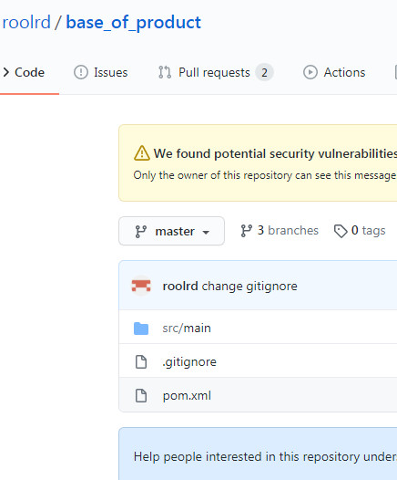  

Create freestile Jenkins-job "Cheking_base_of_product". Install such plugins - "Deploy to container", "Generic Webhook Trigger Plugin". Then configure job:
- add into option "Git" url of github repository

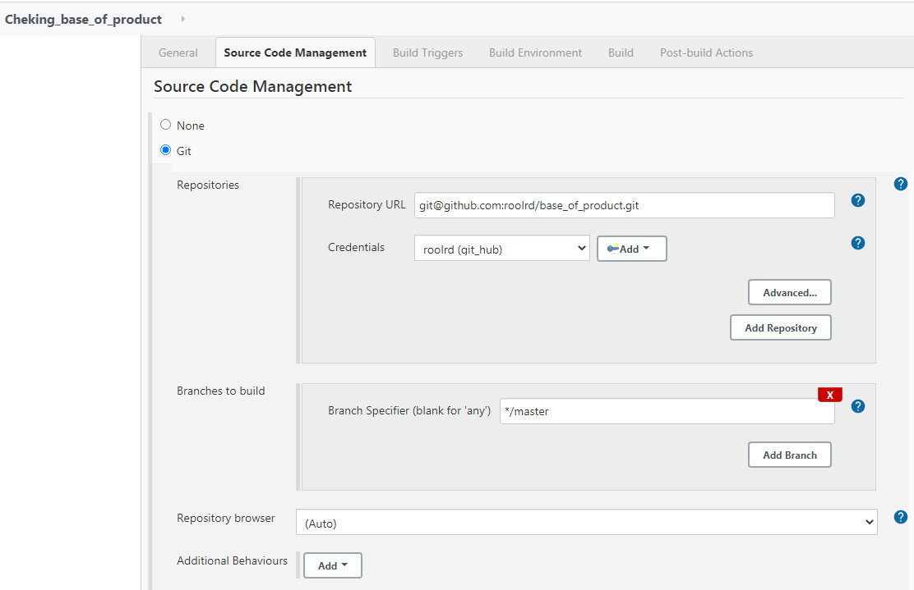  

- add build stages

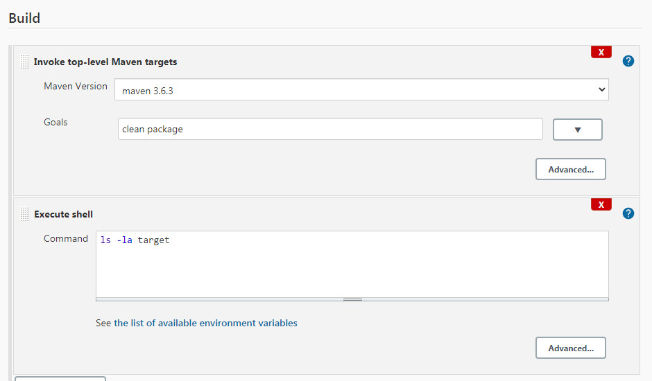  

- configure post-build action for Tomcat-server

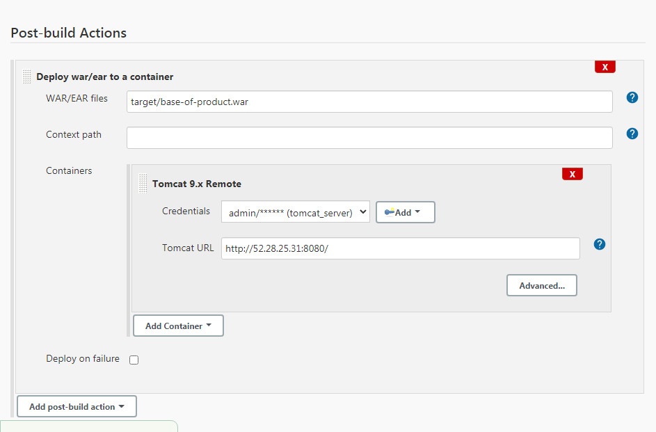  

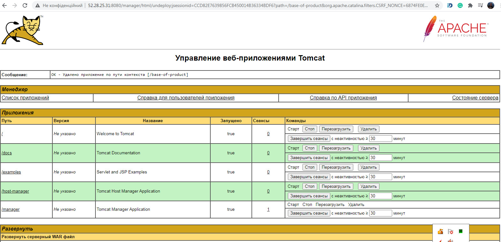  

- configure connection GitHub<->Jenkins

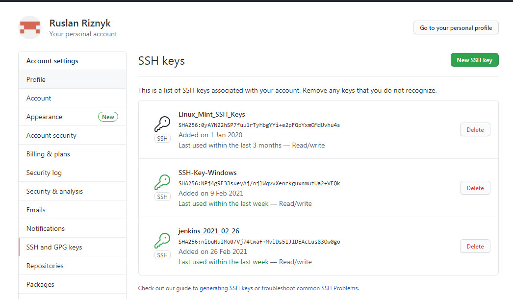  

- configure github project and webhook pipeline

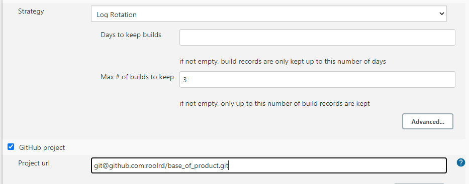  

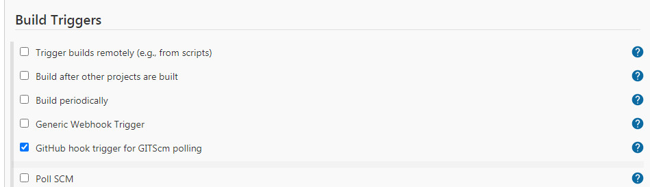  

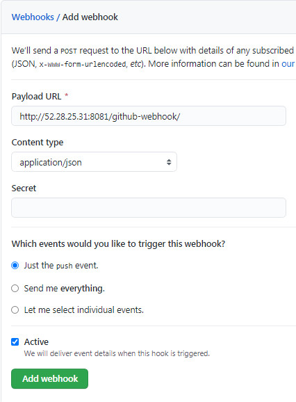  

- try to make some shange in the java app

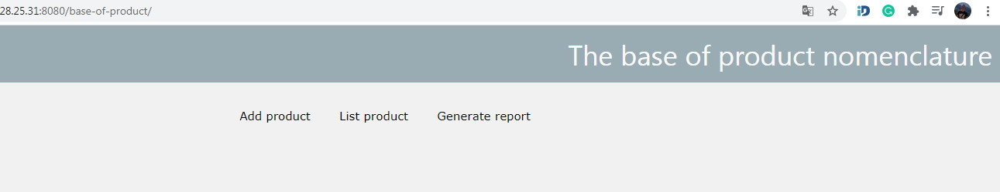  

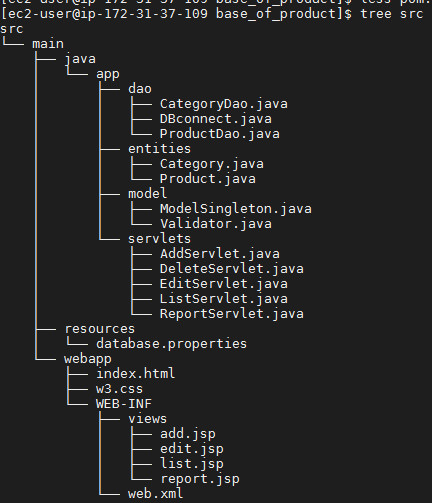  

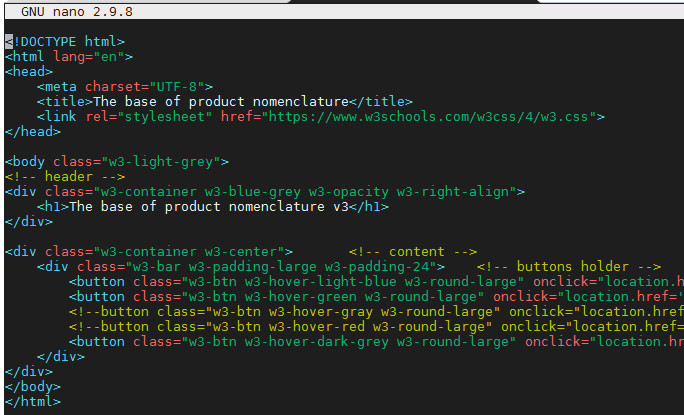  

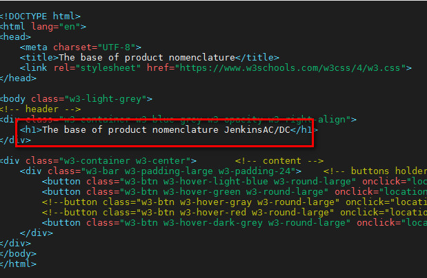  

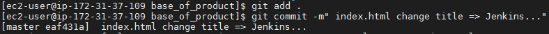  

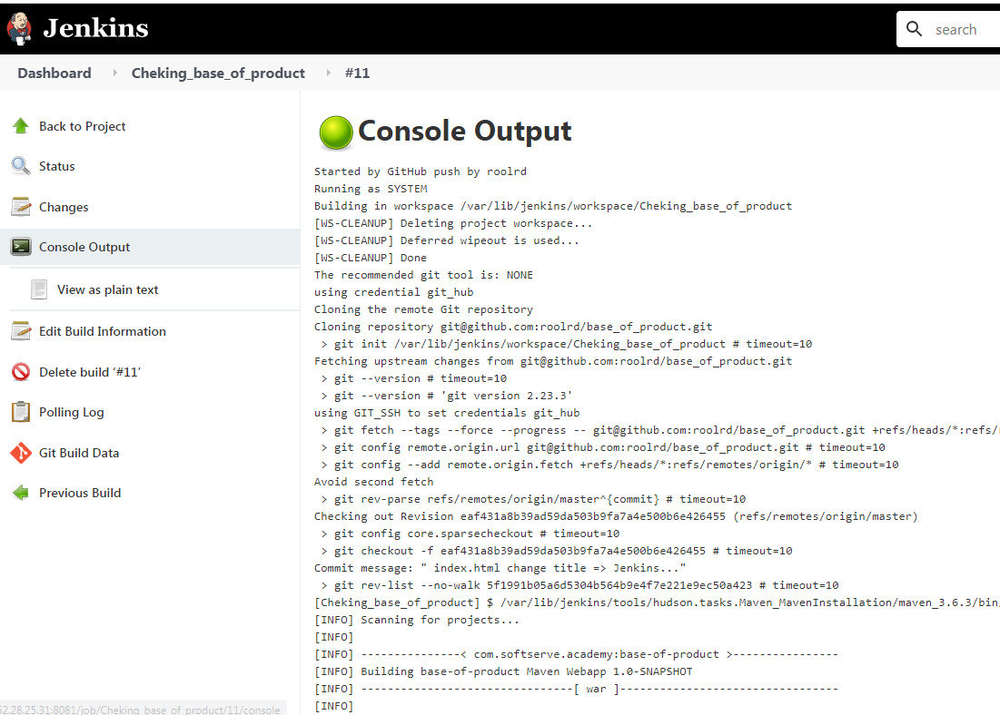  

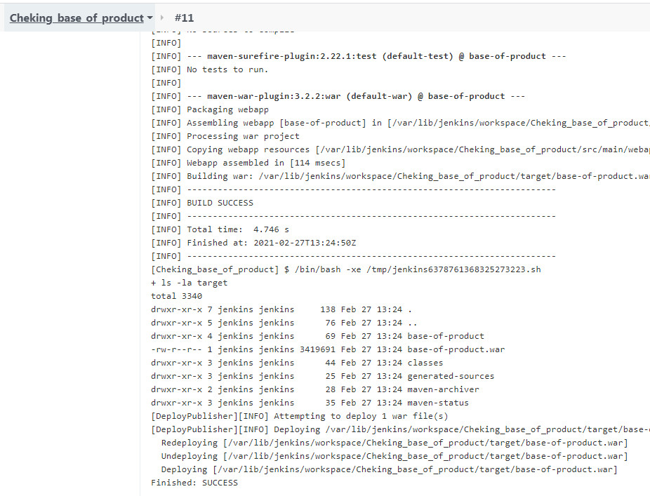  

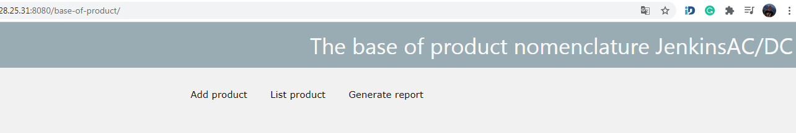  

===========================================
Jenkins 
SSH Build Agents. This plugin is formerly known as "SSH Slaves Plugin". It was renamed in 1.32.0, but the plugin ID was retained as ssh-slaves to retain compatibility for the plugin users.
Перевірити чи може запускатись білд на мастері якщо не вказати лейбли